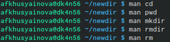
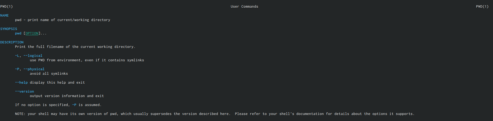
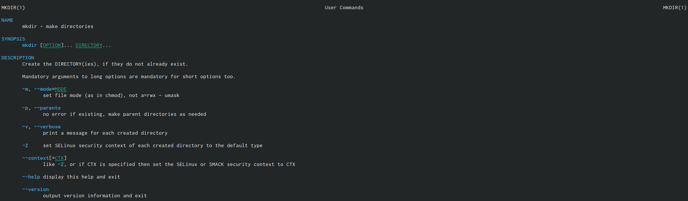
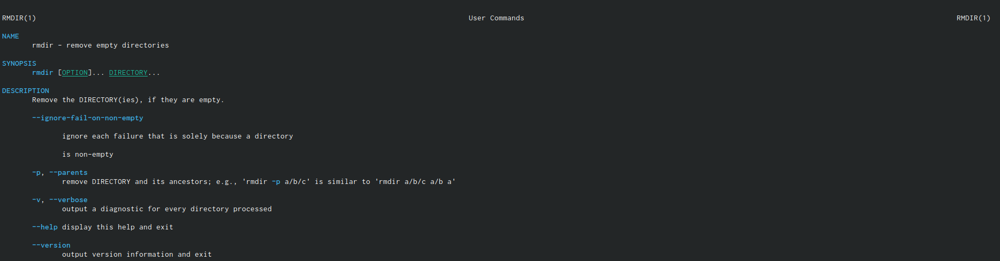
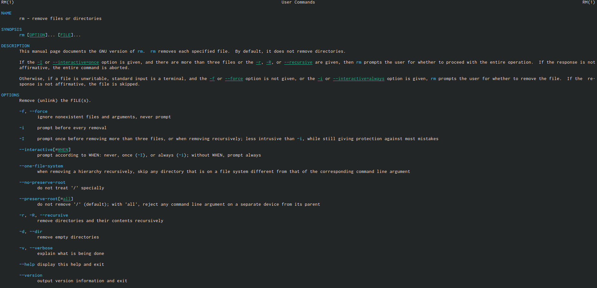

---
## Front matter
lang: ru-RU
title: Лабораторная работа №4
author: Хусяинова Адиля Фаритовна
	
institute: \inst{1}RUDN University, Moscow, Russian Federation
	

## Formatting
toc: false
slide_level: 2
theme: metropolis
aspectratio: 43
section-titles: true
---

# Отчет по лабораторной работе №4

#Основные команды в Linux

Используем команду man для следующих команд: cd,pwd,mkdir,rmdir,rm и далее просматриваем описание соответствующих команд(рис.15)

{ #fig:0015 width=70% }

# Команда pwd

-L, --logical - не разыменовывать символические ссылки. Если путь содержит ссылки, то выводить их без преобразования в исходный путь;
-P, --physical - преобразовывать символические ссылки в исходные имена. Если путь содержит данные ссылки, то они будут преобразованы в названия исходных директорий (на которые они указаны).
--help - показать справку по команде pwd;
--version - показать версию утилиты pwd. 

{ #fig:0017 width=70% }

# Команда mkdir

-m,--mode=MODE - устанавливает права доступа для создаваемой директории. Синтаксис MODE такой же как у команды chmod;
-p,--parents - создаёт все директории, которые указаны внутри пути (если директория существует, сообщение об этом не выводится);
-v, --verbose - выводит сообщение о каждой создаваемой директории;
-z - устанавливает контекст SELinux для создаваемой директории по умолчанию;
--context[=CTX] - устанавливает контекст SELinux для создаваемой директории в значение CTX;
--help - показывает справку по команде mkdir;
--version - показывает версию утилиты mkdir. 

{ #fig:0018 width=70% }

# Команда rmdir

--ignore-fail-on-non-empty - игнорировать директории, которые содержат в себе файлы;
-p, --parents - в этой опции каждый аргумент каталога обрабатывается как путь, из которого будут удалены все компоненты, если они уже пусты, начиная с последнего компонента;
-v, --verbose - отображение подробной информациидля каждого обрабатываемого каталога;
--help - показать справку по команде rmdir;
--version - показать версию утилиты rmdir.

{ #fig:0019 width=70% }

# Команда rm 

-f, --force - игнорировать несуществующие файлы и аргументы. Никогда не выдавать запросы на подтверждение удаления;
-i - выводить запрос на подтверждение удаления каждого файла;
-I - выдать один запрос на подтверждение удаления всех файлов, если удаляется больше трех файлов или используется рекурсивное удаление. Опция применяется, как более «щадящая» версия опции –i;
--interactive[=WHEN] - вместо WHEN можно использовать:never — никогда не выдавать запросы на подтверждение удаления, once — выводить запрос один раз (аналог опции -I). always —выводить запрос всегда (аналог опции -i).Если значение КОГДА не задано, то используется always;
--one-file-system - во время рекурсивного удаления пропускать директории, которые находятся на других файловых системах;
--no-preserve-root - если в качестве директории для удаления задан корневой раздел /, то считать, что это обычная директория и начать выполнять удаление;
--preserve-root[=all] - если в качестве директории для удаления задан корневой раздел /, то запретить выполнять команду rm над корневым разделом. Данное поведение используется по умолчанию;
-r, -R, --recursive - удаление директорий и их содержимого. Рекурсивное удаление;
-d, --dir - удалять пустые директории;
-v, --verbose - выводить информацию об удаляемых файлах;
--help - показать справку по команде rm;
--version - показать версию утилиты rm 

{ #fig:0020 width=70% }

# Вывод

Приобрела практические навыки взаимодействия пользователя с системой с помощью командной строки

