---
## Front matter
title: "Лабораторная работа №4"
subtitle: "Отчет по лаборатоорной работе №4"
author: "Хусяинова Адиля Фаритовна"

## Generic otions
lang: ru-RU

## Bibliography
bibliography: bib/cite.bib
csl: pandoc/csl/gost-r-7-0-5-2008-numeric.csl

## Pdf output format
toc: true # Table of contents
toc-depth: 2
lof: true # List of figures
lot: true # List of tables
fontsize: 12pt
linestretch: 1.5
papersize: a4
documentclass: scrreprt
## I18n polyglossia
polyglossia-lang:
  name: russian
  options:
	- spelling=modern
	- babelshorthands=true
polyglossia-otherlangs:
  name: english
## I18n babel
babel-lang: russian
babel-otherlangs: english
## Fonts
mainfont: PT Serif
romanfont: PT Serif
sansfont: PT Sans
monofont: PT Mono
mainfontoptions: Ligatures=TeX
romanfontoptions: Ligatures=TeX
sansfontoptions: Ligatures=TeX,Scale=MatchLowercase
monofontoptions: Scale=MatchLowercase,Scale=0.9
## Biblatex
biblatex: true
biblio-style: "gost-numeric"
biblatexoptions:
  - parentracker=true
  - backend=biber
  - hyperref=auto
  - language=auto
  - autolang=other*
  - citestyle=gost-numeric
## Pandoc-crossref LaTeX customization
figureTitle: "Рис."
listingTitle: "Листинг"
lofTitle: "Список иллюстраций"
lolTitle: "Листинги"
## Misc options
indent: true
header-includes:
  - \usepackage{indentfirst}
  - \usepackage{float} # keep figures where there are in the text
  - \floatplacement{figure}{H} # keep figures where there are in the text
---

# Цель работы

Приобретение практических навыков взаимодействия пользователя с системой посредством командной строки

# Выполнение лабораторной работы

1)Необходимо определить полное имя домашнего каталога, воспользуемся команду «pwd» (рис.1)

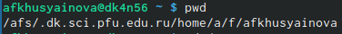{ #fig:001 width=70% }

2).

     2.1) Переходим в каталог /tmp, используя команду «cd /tmp»(рис.2)

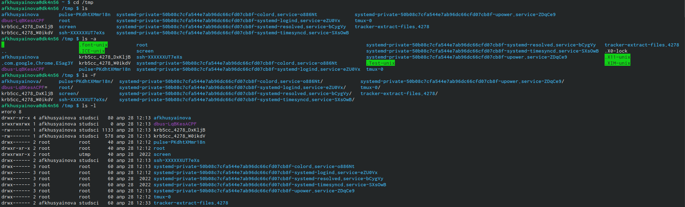{ #fig:002 width=70% }

     2.2) Выводим на экран содержимое каталога /tmp, воспользовавшись командой «ls» с различными опциями: 
        1. «ls» − используется для просмотра каталога, для этого «вручную» открывается каталог tmp.
        2. «ls -a» − отбирает имена скрытых файлов, (их имена начинаются с точки), 
        3. «ls -F» − получаем информацию о типах файлов (каталог, исполняемый файл, ссылка). При использовании этой опции в поле имени выводится символ, который определяет тип файла.
        4. «ls -l» − выводит на экран более подробную информацию о файлах к каталогам. 
        5. «ls -alF» − данная команда отобразит список всех каталогов и файлов, в том числе и скрытых, с подробной информацией о них(рис.3)

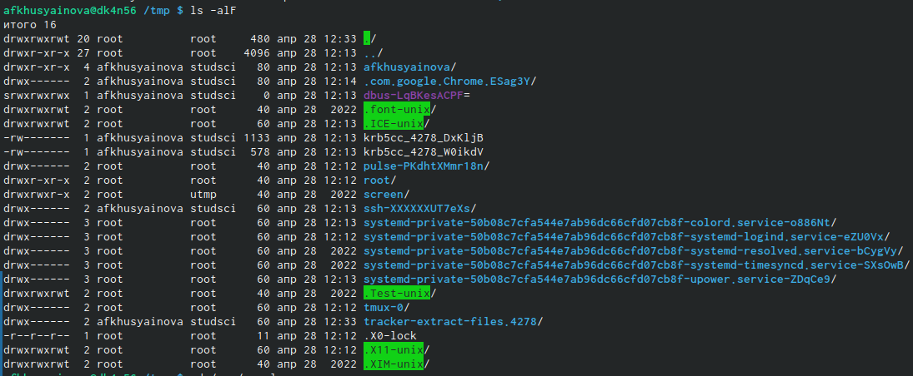{ #fig:003 width=70% }

     2.3) Определяем существование в каталоге /var/spool подкаталога с именем cron, перейдем в каталог воспользовавшись командой «cd /var/spool», просматриваем его содержимое с помощью команды «ls»(рис.4).Убеждаемся в его существование.

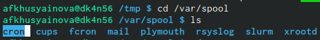{ #fig:004 width=70% }
 

     2.4) Переходим в свой домашний каталог с помощью команды «cd --» и, используя команду «ls -alF».Вывожу на экран его содержимое. Видно, что владельцем всех каталогов и файлов, что пользователь afkhusyainova из группы пользователей afkhusyainova является аладельцем каталогов и файлов (рис.5)

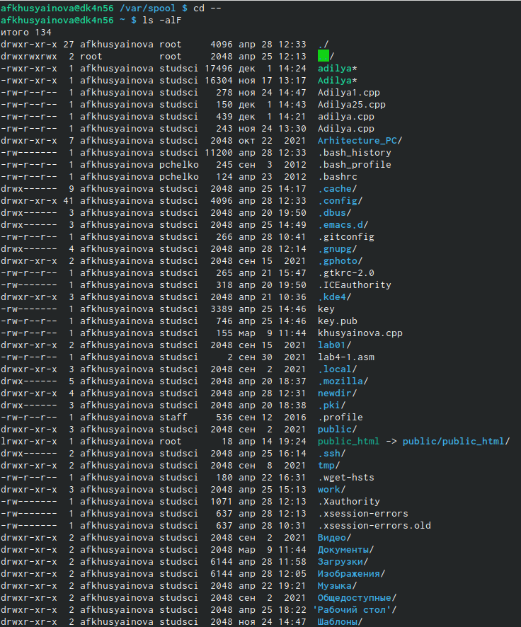{ #fig:005 width=70% }
3).
     3.1) В домашнем каталоге создаем новый каталог с именем newdir, воспользуемся командой «mkdir newdir» и проверяем существование каталога с помощью команды «ls» (рис.6)

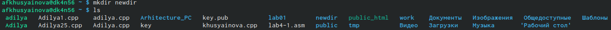{ #fig:006 width=70% }

     3.2) Командой «cd newdir» переходим в ранее созданный каталог и там создаем каталог morefun, используя команду «mkdir morefun». Командой «ls» проверяем действия (рис.7)

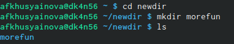{ #fig:007 width=70% }

     3.3) Создаем три новых каталога воспользовавшись командой «mkdir letters memos misk». Далее с помощью команды «rm –r letters memos misk» удаляем созданные каталоги и проверяем командой «ls» (рис.8)

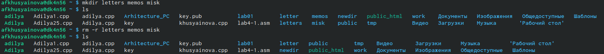{ #fig:008 width=70% }

     3.4) Попробуем удалить каталог newdir командой «rm newdir», но получаем отказ (т.к. данный каталог содержит подкаталог morefun и требуется при удалении использовать опцию -r)

     3.5) Удаляем каталог newdir/morefun, используя команду «rm –rnewdir/morefun», делаем проверку командой «ls» (рис.9)

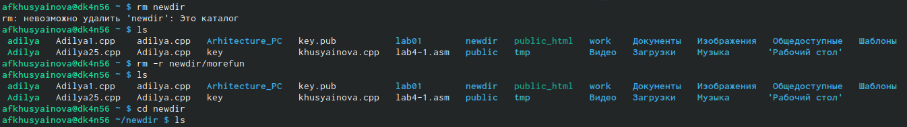{ #fig:009 width=70% }

4) Используем команду «man ls», определяем, какую опцию команды ls необходимо использовать, чтобы просмотреть содержимое не только указанного каталога, но и подкаталогов, входящих в него (рис.10)(рис.11)

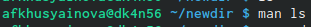{ #fig:0010 width=70% }

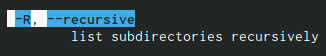{ #fig:0011 width=70% }

5) Определяем набор опций команды ls, позволяющий отсортировать по времени последнего изменения выводимый список содержимого каталога с развернутым описанием файлов (рис.12)(рис.13)(рис.14)

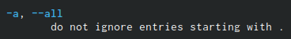{ #fig:0012 width=70% }

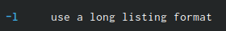{ #fig:0013 width=70% }

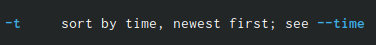{ #fig:0014 width=70% } 

6) Используя команды «man cd», «man pwd», «man mkdir», «man rmdir», «man rm», просматриваем описание соответствующих команд (рис.15)

{ #fig:0015 width=70% } 

Команда cd не обладает дополнительных опций.

Команда pwd(рис.17)

{ #fig:0017 width=70% } 

Команда mkdir(рис.18)

{ #fig:0018 width=70% } 

Команда rmdir(рис.19)

{ #fig:0019 width=70% } 

Команда rm(рис.20)

{ #fig:0020 width=70% } 

7) Выведем историю команд с помощью команды «history» { #fig:0021 width=70% }

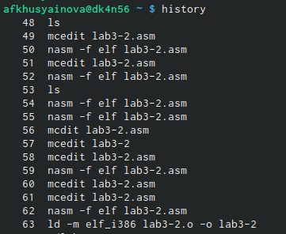{ #fig:0021 width=70% } 

Контрольные вопросы:
1) Командная строка – специальная программа,которая позволяет управлять операционной системой при помощи текстовых команд, вводимых в окне приложения.
2) Для определения абсолютного пути к текущему каталогу используется команда pwd.Пример, команда «pwd» в моем домашнем каталоге выведет: /home/afkhusyainova
3) Команда «ls -F» выведет имена файлов в текущем каталоге и их типы, пример приведен на рис.2
4) Имена скрытых файлов начинаются с точки. Эти файлы в операционной системе скрыты от просмотра и обычно используются для настройки рабочей среды. Для того, чтобы отобразить имена скрытых файлов, необходимо использовать команду «ls –a», пример показан на рис.2
5) Команда rm используется для удаления файлов и/или каталогов. Команда rm -i выдает запрос подтверждения на удаление файла. Команда rm -r необходима, чтобы удалить каталог, содержащий файлы. Без указания этой опции команда не будет выполняться. Если каталог пуст, то можно воспользоваться командой rmdir. Если удаляемый каталог содержит файлы, то команда не будет выполнена – нужно использовать «rm -r имя_каталога».таким образом, каталог, не содержащий файлов, можно удалить и командой rm, и командой rmdir. Файл командой rmdir удалить нельзя, пример показан на рис.9
6) Чтобы определить, какие команды выполнил пользователь в сеансе работы, необходимо воспользоваться командой «history».
7) Чтобы исправить или запустить на выполнение команду, которую пользователь уже использовал в сеансе работы, необходимо: в первом случае: воспользоваться конструкцией !<номер_команды>:s/<что_меняем>/<на_что_меняем>, во втором случае: !<номер_команды>. Примеры на Рисунке 23.
8) Чтобы записать в одной строке несколько команд, необходимо между ними поставить ; . Например, «cd /tmp; ls».
9) Символ обратного слэша \ позволяет использовать управляющие символы ( ".", "/", "$", "*", "[", "]", "^", "&") без их интерпретации командной оболочкой; процедура добавления данного символа перед управляющими символами называется экранированием символов. Например, команда «ls newdir\/morefun» отобразит содержимое каталога newdir/morefun.
10) Команда «ls -l» отображает список каталогов и файлов с подробной информацией о них (тип файла, право доступа, число ссылок, владелец, размер, дата последней ревизии, имя файла или каталога).
11) Полный, абсолютный путь от корня файловой системы, он начинается от корня "/" и описывает весь путь к файлу или каталогу; Относительный путь – это путь к файлу относительно текущего каталога (каталога, где находится пользователь). Например, «cd /newdir/morefun» – абсолютный путь, «cd newdir» – относительный путь.
12) Чтобы получить интересующую нас информацию о команде, необходимо воспользоваться конструкцией man [имя_команды].
13) Для автоматического дополнения вводимых команд служит клавиша Tab.

# Вывод

Я приобрела практические навыки взаимодействия пользователя с системой посредством командной строки.

