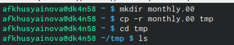
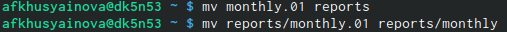
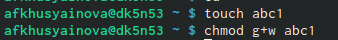

---
## Front matter
lang: ru-RU
title: Лабораторная работа №5
author: Хусяинова Адиля Фаритовна
institute: \inst{1}RUDN University, Moscow, Russian Federation
	
## Formatting
toc: false
slide_level: 2
theme: Отчет по лабораторной работе №5
aspectratio: 43
section-titles: true
---

# Отчет по лабораторной работе №5

#Суть работы

Необходимо изучить команды для работы с файлами и каталогами. Такие команды, как копирование, перемименования,перемещение и команды установки прав доступа.

# Копирование каталогов и файлов

Создавая новые каталоги и файлы, работая с ними мы применяли команду cp(рис.1)

{ #fig:001 width=70% }

# Переименование и перемещение файлов в каталоге

Воспользуемся командой mv(рис.2)

{ #fig:002 width=70% }

# Права доступа

В зависимости от изменений мы можем утратить какие-то возможности в отношениии файлов и каталогов.

{ #fig:003 width=70% } 

# Файловая система в Linux

Система состоит из файлов и каталогов, каждому физическому носителю соответствует своя файловая система. Имеется несколько типов файловых систем, такие как: -ext4 (fourth extended file system); -ext2fs (second extended file system) и т.д.

# Вывод

В ходе выполнения данной лабораторной работы, я приобрела навыки владения инструментами поиска файлов, также практические навыки по управлению процессами, по обслуживанию файловых систем

