---
## Front matter
title: "Лабораторная работа №5"
subtitle: "Отчет по лабораторной работе"
author: "Хусяинова Адиля Фаритовна"

## Generic otions
lang: ru-RU

## Pdf output format
toc-depth: 2
fontsize: 12pt
linestretch: 1.5
papersize: a4
documentclass: scrreprt
## I18n polyglossia
polyglossia-lang:
  name: russian
  options:
	- spelling=modern
	- babelshorthands=true
polyglossia-otherlangs:
  name: english
## I18n babel
babel-lang: russian
babel-otherlangs: english
## Fonts
mainfont: PT Serif
romanfont: PT Serif
sansfont: PT Sans
monofont: PT Mono
mainfontoptions: Ligatures=TeX
romanfontoptions: Ligatures=TeX
sansfontoptions: Ligatures=TeX,Scale=MatchLowercase
monofontoptions: Scale=MatchLowercase,Scale=0.9
## Biblatex
biblatex: true
biblio-style: "gost-numeric"
biblatexoptions:
  - parentracker=true
  - backend=biber
  - hyperref=auto
  - language=auto
  - autolang=other*
  - citestyle=gost-numeric
## Pandoc-crossref LaTeX customization
figureTitle: "Рис."
tableTitle: "Таблица"
listingTitle: "Листинг"
lofTitle: "Список иллюстраций"
lotTitle: "Список таблиц"
lolTitle: "Листинги"
## Misc options
indent: true
header-includes:
  - \usepackage{indentfirst}
  - \usepackage{float} # keep figures where there are in the text
  - \floatplacement{figure}{H} # keep figures where there are in the text
---

# Цель работы

Ознакомление с файловой системой Linux, её структурой, именами и содержанием каталогов. Приобретение практических навыков по применению команд для работы с файлами и каталогами, по управлению процессами (и работами), по проверке использования диска и обслуживанию файловой системы.

# Задание

1) Сделать отчёт по лабораторной работе №5 в формате Markdown.
2) В качестве отчёта просьба предоставить отчёты в 3 форматах: pdf, docx и md (в архиве,
поскольку он должен содержать скриншоты, Makefile и т.д.).

# Выполнение лабораторной работы

1. Выполним все примеры, которые приведены в первой части лабораторной работы(рис.1-3)
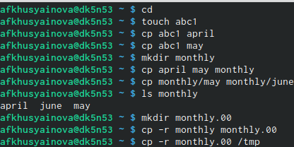{ #fig:001 width=70% }

{ #fig:002 width=70% }

{ #fig:003 width=70% }
2.
2.1 Скопируем файл  /usr/include/sys/io.h в домашний каталог,которые назовем equipment(рис.4)

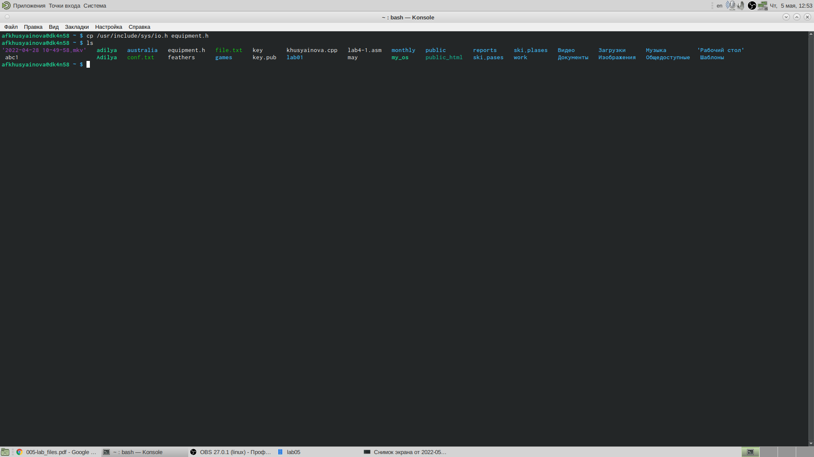{ #fig:004 width=70% }

2.2 В домашнем каталоге создаем директорию ~/ski.plases, далее перемещаем файл equipment в каталог ~/ski.plases(рис.5)

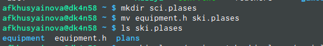{ #fig:005 width=70% }

2.4 Переменуем файл ~/ski.plases/equipment в ~/ski.plases/equiplist(рис.6)

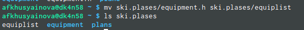{ #fig:006 width=70% }

2.5. Создадим в домашнем каталоге файл abc1 и скопируем его в каталог ~/ski.plases, назовем его equiplist2.Создадим каталог с именем equipment в каталоге ~/ski.plases Переместим файлы ~/ski.plases/equiplist и equiplist2 в каталог ~/ski.plases/equipment.

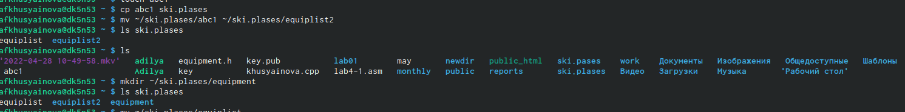{ #fig:007 width=70% }

2.8. Создадим и переместим каталог ~/newdir в каталог ~/ski.plases и назовем его plans(рис.8)

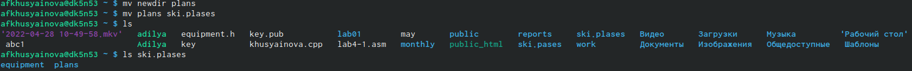{ #fig:008 width=70% }

3. Определим опции команды chmod, необходимые для того, чтобы присвоить файлам и каталогам соответственные права доступа.Предварительно создаем необходимые файлы с помощью команд: mkdir australia, mkdir play, touch my_os, touch feathers(рис.9)

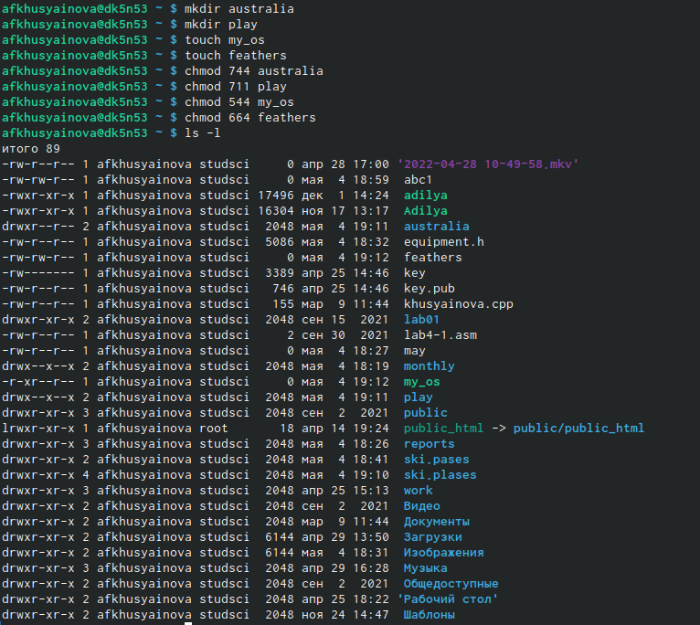{ #fig:009 width=70% }

1. drwxr–r–… australia: команда «chmod 744 australia» - это каталог, владелец имеет право на чтение, запись и выполнение, группа владельца и остальные – только чтение.
2. drwx–x–x … play: команда «chmod 711 play» - это каталог, владелец имеет право на чтение, запись и выполнение, группа владельца и остальные – только выполнение. 
3. -r-xr–r–… my_os: команды «chmod 544 my_os» - это файл, владелец имеет право на чтение и выполнение, группа владельца и остальные – только чтение.
4. -rw-rw-r–… feathers: команды «chmod 664 feathers» - это файл, владелец и группа владельца имеют право на чтение и запись, остальные – только чтение. Командой «ls-l» проверяем правильность выполненных действий.

4.
4.1 Просмотрим содержимое файла /etc/password(рис.10)

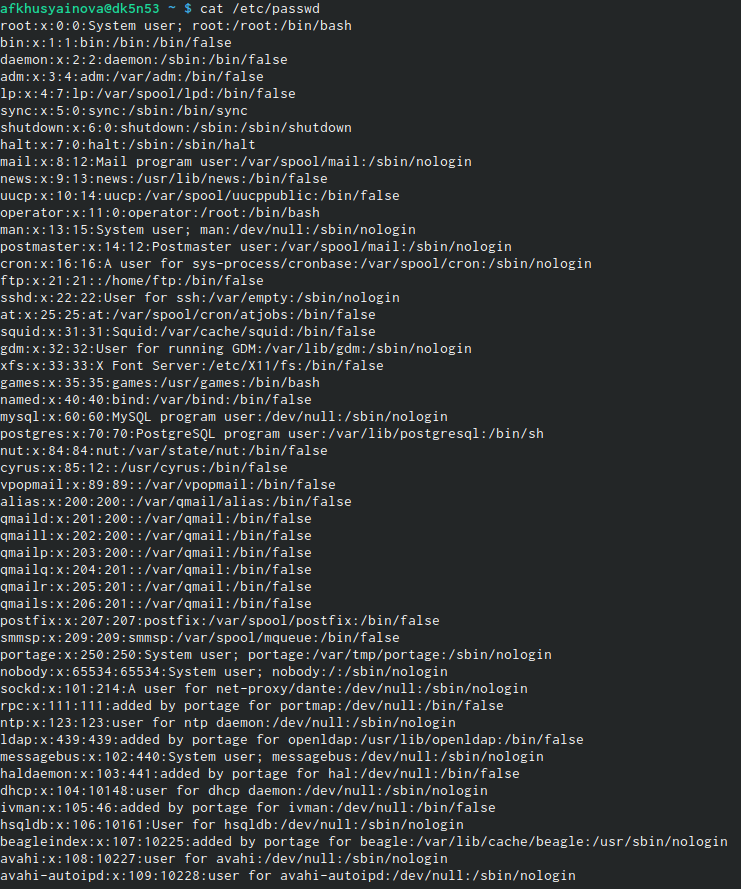{ #fig:0010 width=70% }

4.2. Скопируем файл ~/feathers в файл ~/file.old, 4.3. Переместим файл ~/file.old в каталог ~/play,4.4. Скопируем каталог ~/play в каталог ~/fun,4.5. Переместим каталог ~/fun в каталог ~/play и назовем его games,4.6. Лишим владельца файла ~/feathers права на чтение,4.7. При попытки просмотра файла ~/feathers командой cat, получаем отказ в доступе, т.к. в предыдущем пункте лишили владельца права на чтение данного файла, 4.8. При попытки копирования файла ~/feathers, например, в каталог monthly, получаем отказ в доступе,по той же причине, что и в предыдущем пункте, 4.9. Предоставляем владельцу файла ~/feathers право на чтение (команда «chmod u+r feathers»). 4.10. Лишаем владельца каталога ~/games права на выполнение(с помощью команды «chmod u-x games»). 4.11. При переходе в каталог ~/games (команда «cd games»),получаем отказ в доступе, т.к. в предыдущем пункте лишили владельца права на выполнение данного каталога. 4.12. Даём владельцу каталога ~/games право на выполнение (команда «chmod u+ xgames»). (рис.11)(рис.12)(рис.13)

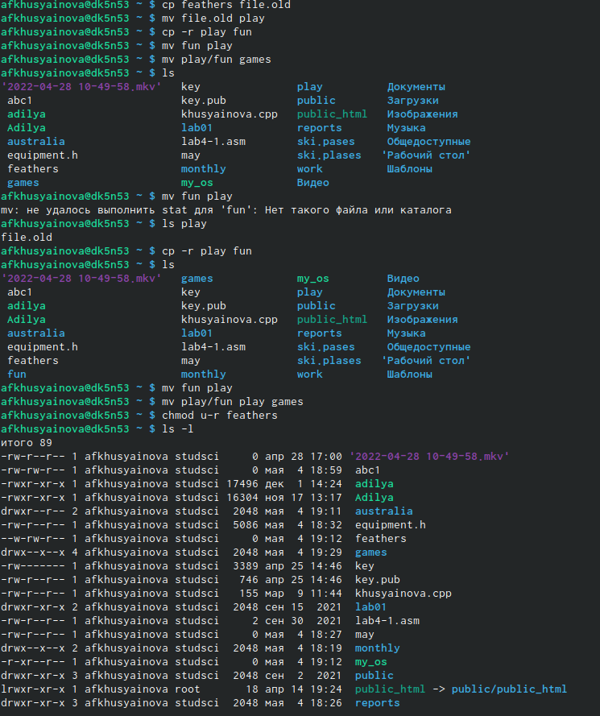{ #fig:0011 width=70% }

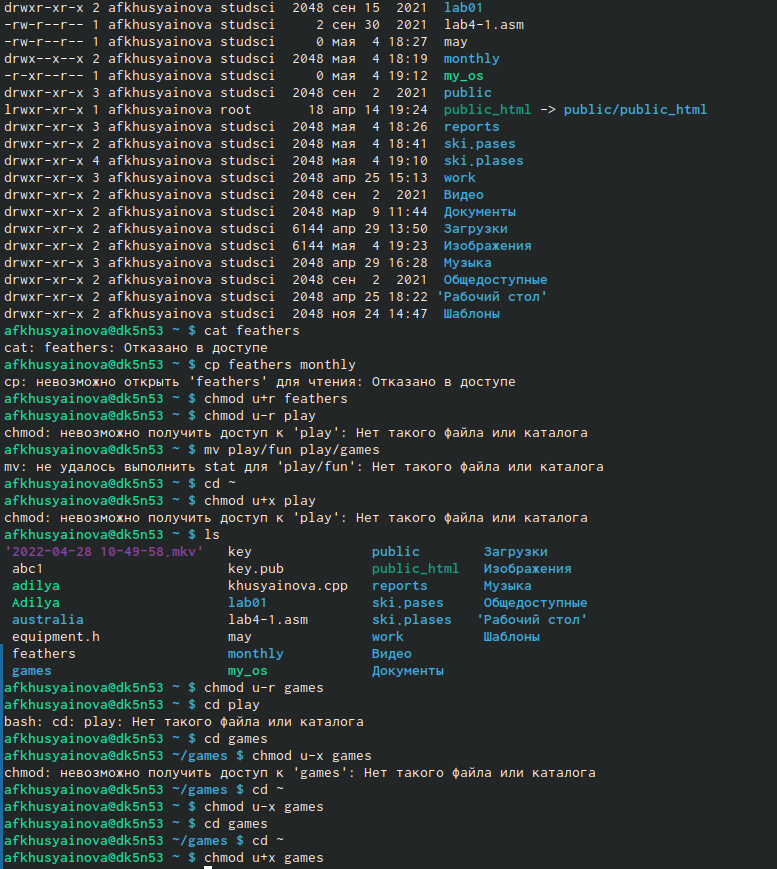{ #fig:0012 width=70% }

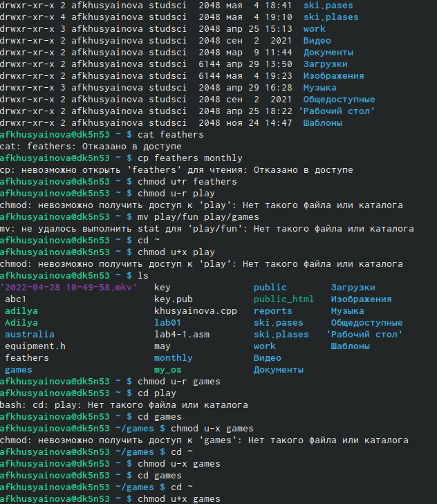{ #fig:0013 width=70% }

5. Прочитаем man по командам mount, fsck, mkfs, kill и кратко их охарактеризуем.

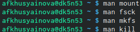{ #fig:0014 width=70% }

Для просмотра используемых в ос файловых систем, воспользуемся командой mount без параметров.

Целостность файловых систем можно проверить(иногда даже восстановить), воспользовавшись командой fsck. 

Чтобы создавать файловые системы в Linux, воспользуемся командой mkfs.

Запущенные рабочие процессы можно "убить" с помощью команды kill.
# Выводы

Я ознакомилась с файловой системой Linux, её структурой, именами и содержанием каталогов, также приобрела практические навыки по применению команд для работы с файлами и каталогами, по управлению процессами (и работами), по проверке использования диска и обслуживанию файловой системы.

# Контрольные вопросы

1).Чтобы узнать, какие файловые системы существуют на жёстком диске моего компьютера, использую команду «df-Th». Из рисунка видно, что на моем компьютере есть следующие файловые системы: dev tmpfs,tmpfs,ext4,iso9660. dev tmpfs позволяет ядру создать экземпляр tmpfs с именем devtmpfs при инициализации ядра, прежде чем регистрируется какое-либо устройство с драйверами. Каждое устройство с майором / минором будет предоставлять узел устройства в devtmpfs.devtmpfs монтируется на /dev и содержит специальные файлы устройств для всех устройств.tmpfs−временное файловое хранилище во многих Unix-подобных ОС. Предназначена для монтирования файловой системы, но размещаетсяв ОЗУ вместо ПЗУ. Подобная конструкция является RAM диском. Данная файловая система также предназначенная для быстрого и ненадёжного хранения временных данных. Хорошо подходит для /tmp и массовой сборки пакетов/образов.Предполагает наличие достаточного объёма виртуальной памяти.Файловая система tmpfs предназначенадля того, чтобы использовать часть физической памяти сервера как обычный дисковый раздел, в котором можно сохранять данные (чтение и запись). Поскольку данные размещены в памяти, то чтение или запись происходят во много раз быстрее, чем с обычного HDD диска.ext4− имеет обратную совместимость с предыдущими версиями ФС. Эта версия была выпущена в 2008 году. Является первой ФС из «семейства»Ext, использующая механизм «extentfile system», который позволяет добиться меньшей фрагментации файлов и увеличить общую производительностьфайловой системы. Кроме того, вExt4реализован механизм отложенной записи (delayed allocation −delalloc), который так же уменьшает фрагментацию диска и снижает нагрузку на CPU. С другой стороны, хотя механизм отложенной записи и используется во многих ФС, но в силу сложности своей реализации он повышает вероятность утери данных.Характеристики:максимальный размер файла: 16 TB; максимальный размер раздела: 16TB;максимальный размер имени файла: 255 символов.Рекомендации по использованию:наилучший выбор дляSSD; наилучшая производительность по сравнению с предыдущимиEtx-системами;она так же отлично подходит в качестве файловой системы для серверов баз данных, хотя сама система и моложеExt3.ISO 9660−стандарт, выпущенный Международной организацией по стандартизации, описывающий файловую систему для дисков CD-ROM. Также известен как CDFS (Compact Disc File System). Целью стандарта является обеспечить совместимость носителей под разными операционными системами, такими, как Unix, Mac OS, Windows.
2). Файловая система Linux/UNIX физически представляет собой пространство раздела диска разбитое на блоки фиксированного размера, кратные размеру сектора − 1024, 2048, 4096 или 8120 байт. Размер блока указывается при создании файловой системы.В файловой структуре Linux имеется один корневой раздел −/ (он же root, корень). Все разделы жесткого диска (если их несколько) представляют собой структуру подкаталогов, “примонтированных” к определенным каталогам. 
- “/” − корень. Это главный каталог в системе Linux. По сути, это и есть файловая система Linux.Адреса всех файлов начинаются с корня, а дополнительные разделы, флешки или оптические диски подключаются в папки корневого каталога. Только пользователь root имеет право читать и изменять файлы в этом каталоге. 
- “/BIN” – бинарные файлы пользователя. Этот каталог содержит исполняемые файлы. Здесь расположены программы, которые можно использовать в однопользовательском режиме или режиме восстановления.
- “/SBIN” – системные испольняемые файлы. Так же как и “/bin”, содержит двоичные исполняемые файлы, которые доступны на ранних этапах загрузки, когда не примонтирован каталог /usr. Но здесь находятся программы, которые можно выполнять только с правами суперпользователя. 
- “/ETC” – конфигурационные файлыВ этой папке содержатся конфигурационные файлы всех программ, установленных в системе.Кроме конфигурационных файлов, в системе инициализации Init Scripts, здесь находятся скрипты запуска и завершения системных демонов, монтирования файловых систем и автозагрузки программ. 
- “/DEV” – файлы устройствВ Linux все, в том числе внешние устройства являются файлами. Таким образом, все подключенные флешки, клавиатуры, микрофоны, камеры −это просто файлы в каталоге /dev/. Выполняется сканирование всех подключенных устройств и создание для них специальных файлов.
- “/PROC” –информация о процессахПо сути, это псевдофайловая система, содержащая подробную информацию о каждом процессе, его Pid, имя исполняемого файла, параметры запуска, доступ к оперативной памяти и так далее. Также здесь можно найти информацию об использовании системных ресурсов.
- “/VAR” – переменные файлы. Название каталога “/var” говорит само за себя, он должен содержать файлы, которые часто изменяются. Размер этих файлов постоянно увеличивается. Здесь содержатся файлы системных журналов, различные кеши, базы данных и так далее. 
- “/TMP” – временные файлыВ этом каталоге содержатся временные файлы, созданные системой, любыми программами или пользователями. Все пользователи имеют право записи в эту директорию. 
- “/USR” – программы пользователяЭто самый большой каталог с большим количеством функций. Здесь находятся исполняемые файлы, исходники программ, различные ресурсы приложений, картинки, музыку и документацию. 
- “/HOME” – домашняя папка. В этой папке хранятся домашние каталоги всех пользователей. В них они могут хранить свои личные файлы, настройки программ и т.д.
- “/BOOT” – файлы загрузчика. Содержит все файлы,связанные с загрузчиком системы. Это ядро vmlinuz, образ initrd, а также файлы загрузчика, находящие в каталоге /boot/grub. 
- “/LIB” – системные библиотеки. Содержит файлы системных библиотек, которые используются исполняемыми файлами в каталогах /bin и /sbin. 
- “/OPT” – дополнительные программыВ эту папку устанавливаются проприетарные программы, игры или драйвера. Это программы созданные в виде отдельных исполняемых файлов самими производителями. 
- “/MNT” – монтирование. В этот каталог системные администраторы могут монтировать внешние или дополнительные файловые системы. 
- “/MEDIA” –съемные носители. В этот каталог система монтирует все подключаемые внешние накопители –USB флешки, оптические диски и другие носители информации. 
- “/SRV” – сервер. В этом каталоге содержатся файлы серверов и сервисов. 
- “/RUN” -процессыКаталог,содержащий PID файлы процессов, похожий на “/var/run”, но в отличие от него, он размещен в TMPFS, а поэтому после перезагрузки все файлы теряются.
3). Чтобы содержимое некоторой файловойсистемы было доступно операционной системе необходимо воспользоваться командой mount.
4). Целостность файловой системы может быть нарушена из-за перебоевв питании, неполадок в оборудовании или из-за некорректного/внезапного выключения компьютера. Чтобы устранить повреждения файловой системы необходимо использовать команду fsck.
5). Файловую систему можно создать, используя команду mkfs. Ее краткое описание дано в пункте 5) в ходе выполнения заданий лабораторной работы.
6). Для просмотра текстовых файлов существуют следующие команды: - сat. Задача команды cat очень проста −она читает данные из файла или стандартного ввода и выводит их на экран. Синтаксис утилиты:cat [опции] файл1 файл2 …Основные опции:-b–нумеровать только непустые строки-E–показыватьсимвол $ в конце каждой строки-n–нумеровать все строки-s–удалять пустые повторяющиеся строки -T–отображать табуляции в виде ^I-h–отобразить справку-v–версия утилиты - nl. Команда nl действует аналогично командеcat, новыводит еще иномера строк встолбце слева. - less. Cущественно более развитая командадля пролистывания текста. При чтении данных со стандартного ввода она создает буфер, который позволяет листать текст как вперед, так и назад, а также искать как по направлению к концу, так и по направлению к началу текста.Синтаксис аналогичный синтаксисукоманды cat.Некоторые опции:-g –при поиске подсвечивать только текущее найденное слово (по умолчанию подсвечиваются все вхождения)-N –показывать номера строк - head. Команда head выводит начальные строки (по умолчанию − 10) из одного или нескольких документов. Также она может показывать данные, которые передает на вывод другая утилита.Синтаксис аналогичный синтаксису команды cat.Основные опции:-c (–bytes) −позволяет задавать количество текста не в строках, а в байтах-n (–lines) −показывает заданное количество строк вместо 10, которые выводятся по умолчанию-q (–quiet, –silent) −выводит только текст, недобавляя к нему название файла-v (–verbose) −перед текстом выводит название файла -z (–zero-terminated) −символы перехода на новую строку заменяет символами завершения строк - tailЭта командапозволяет выводить заданное количество строк с конца файла, а также выводить новые строки в интерактивном режиме.Синтаксис аналогичный синтаксису команды cat.Основные опции:-c −выводить указанное количество байт с конца файла-f −обновлять информацию по мере появления новых строк в файле-n −выводить указанное количество строк из конца файла–pid −используется с опцией -f, позволяет завершить работу утилиты, когда завершится указанный процесс-q −не выводить имена файлов–retry− повторять попытки открыть файл, если он недоступен-v −выводить подробную информацию о файле.
7). Утилита cpпозволяет полностью копировать файлы и директории.Cинтаксис:cp [опции] файл-источник файл-приемникПосле выполнения команды файл-источник будет полностью перенесен в файл-приемник. Если в конце указан слэш, файл будет записан в заданную директорию с оригинальным именем.Основные опции:–attributes-only −не копировать содержимое файла, а только флаги доступа и владельца-f, –force −перезаписывать существующие файлы-i, –interactive −спрашивать, нужно ли перезаписывать существующие файлы-L −копировать не символические ссылки, а то, на что они указывают -n −не перезаписывать существующие файлы-P −не следовать символическим ссылкам-r −копировать папку Linux рекурсивно-s −не выполнять копирование файлов в Linux, асоздавать символические ссылки-u −скопировать файл, только если он был изменён-x −не выходить за пределы этой файловой системы-p −сохранять владельца, временные метки и флаги доступа при копировании-t −считать файл-приемник директорией и копировать файл-источник в эту директорию.
8). Команда mv используется для перемещения одного или нескольких файлов (или директорий) вдругую директорию, атакже для переименования файлов идиректорий. Синтаксис:mv [-опции] старый_файл новый_файлОсновные опции:–help −выводит на экран официальную документацию об утилите–version −отображает версию mv-b−создает копию файлов, которые были перемещены или перезаписаны-f −при активации не будет спрашивать разрешение у владельца файла, если речь идет о перемещении или переименовании файла -i −наоборот, будет спрашивать разрешение у владельца-n −отключает перезапись уже существующих объектов–strip-trailing-slashes —удаляет завершающий символ / у файла при его наличии-t [директория] —перемещает все файлы в указанную директорию-u −осуществляет перемещение только в том случае, если исходный файл новее объекта назначения -v −отображает сведения о каждом элементе во время обработки командыКоманда renameтакже предназначена, чтобы переименовать файл.Синтаксис:rename [опции] старое_имя новое_имя файлы. Основные опции:-v −вывести список обработанных файлов-n −тестовый режим, на самом деле никакие действия выполнены не будут -f −принудительно перезаписывать существующие файлы.
9). Права доступа− совокупность правил, регламентирующих порядок и условия доступа субъекта к объектам информационной системы (информации, её носителям, процессам и другим ресурсам) установленных правовыми документами или собственником, владельцем информации. Права доступа к файлу или каталогу можно изменить, воспользовавшись командой chmod. Сделать это может владелец файла (или каталога) или пользователь с правами администратора. Синтаксис команды:chmod режим имя_файлаРежим имеет следующие компоненты структуры и способзаписи:= установить право-лишить права+ датьправоr чтениеw записьx выполнениеu (user) владелец файлаg (group) группа, к которой принадлежит владелец файлаo (others) все остальные.

