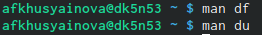

---
## Front matter
lang: ru-RU
title: Лабораторная работа №6
author: Хусяинова Адиля Фаритовна
institute:\inst{1}RUDN University, Moscow, Russian Federation

## Formatting
toc: false
slide_level: 2
theme: Отчет по лабораторной работе №6
aspectratio: 43
section-titles: true
---

# Отчет по лабораторной работе №6

# Основная цель лабораторной работы
-Поиск и фильтрация файлов
-Обслуживание файловых систем

# Фильтрация поиска

Команда find отвечает за поиск файлов, добавляя различные опции, происходила фильтрация нашего поиска. Искали файлы начинающиеся только на 'c' и 'h'

# Работа с процессами

- Запускаем процесс с помощью &
- Статус процесса jobs
- Остановка процесса kill

# Проверка использования диска

Чтобы проверитьть использование диска, воспользуемся командами du и df

{ #fig:001 width=70% }

# Вывод

В ходе выполнения данной лабораторной работы, я приобрела навыки владения инструментами поиска файлов, также практические навыки по управлению процессами, по обслуживанию файловых систем
