---
## Front matter
title: "Лабораторная работа №6"
subtitle: "Отчет по лабораторной работе"
author: "Хусяинова Адиля Фаритовна"

## Generic otions
lang: ru-RU

## Pdf output format
toc-depth: 2
fontsize: 12pt
linestretch: 1.5
papersize: a4
documentclass: scrreprt
## I18n polyglossia
polyglossia-lang:
  name: russian
  options:
	- spelling=modern
	- babelshorthands=true
polyglossia-otherlangs:
  name: english
## I18n babel
babel-lang: russian
babel-otherlangs: english
## Fonts
mainfont: PT Serif
romanfont: PT Serif
sansfont: PT Sans
monofont: PT Mono
mainfontoptions: Ligatures=TeX
romanfontoptions: Ligatures=TeX
sansfontoptions: Ligatures=TeX,Scale=MatchLowercase
monofontoptions: Scale=MatchLowercase,Scale=0.9
## Biblatex
biblatex: true
biblio-style: "gost-numeric"
biblatexoptions:
  - parentracker=true
  - backend=biber
  - hyperref=auto
  - language=auto
  - autolang=other*
  - citestyle=gost-numeric
## Pandoc-crossref LaTeX customization
figureTitle: "Рис."
tableTitle: "Таблица"
listingTitle: "Листинг"
lofTitle: "Список иллюстраций"
lotTitle: "Список таблиц"
lolTitle: "Листинги"
## Misc options
indent: true
header-includes:
  - \usepackage{indentfirst}
  - \usepackage{float} # keep figures where there are in the text
  - \floatplacement{figure}{H} # keep figures where there are in the text
---

# Цель работы

Ознакомление с инструментами поиска файлов и фильтрации текстовых данных. Приобретение практических навыков: по управлению процессами (и заданиями), по проверке использования диска и обслуживанию файловых систем.

# Задание

1) Сделать отчёт по лабораторной работе №6 в формате Markdown.
2) В качестве отчёта просьба предоставить отчёты в 3 форматах: pdf, docx и md (в архиве,
поскольку он должен содержать скриншоты, Makefile и т.д.).

# Выполнение лабораторной работы

1. Осуществляем вход в системуя, используя соответствующе имя пользхователя.

2. Запишим в файл file.txt названия файлов, содержащихся в каталоге /etc и допишем названия файлов, содержащихся в каталоге /etc, используем команду «ls–a/etc> file.txt». Далее с помощью команды «ls-a~ >> file.txt» дописываем в этот же файл названия файлов, содержащихся в домашнем каталоге. Командой «catfile.txt» просматриваем файл(рис.1)

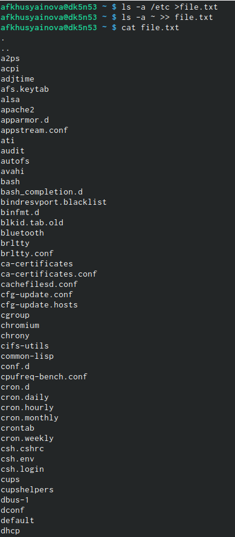{ #fig:001 width=70% }

3. Выводим имена всех файлов из file.txt, имеющих расширение .conf, записываем их в новый текстовой файл conf.txt, используя команду «grep-e‘.conf$’file.txt> conf.txt». С помощью команды «catconf.txt», можем проверить правильность наших действий(рис.2)

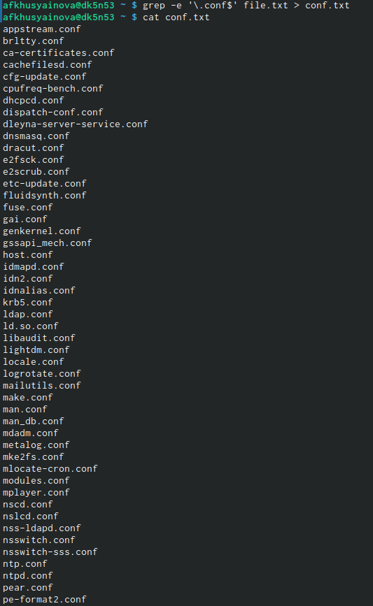{ #fig:003 width=70% }

4. Определить, какие файлы в домашнем каталоге имеют имена, начинающиеся с символа "c", можно несколькими командами: - «find~ -maxdepth1 -name“c” -print», - «ls~/c»; - «ls–a~ | grepc*»

{ #fig:005 width=70% }

5. Чтобы вывестина экран имена файлов из каталога /etc, начинающиеся с символа "h", используем команду find /etc –maxdepth1 –name “h*” | less

{ #fig:006 width=70% }

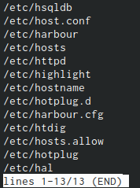{ #fig:007 width=70% }

6. Запускаем в фоновом режиме процесс, который будет записывать в файл ~/logfile файлы, имена которых начинаются с log, используя команду «find/ -name“log*” > logfile&». Командой «catlogfile» проверяю выполненные действия (Рисунок 10). Далее удалила файл ~/logfile с помощью команды «rm logfile», данный файл уже был удалён, поэтому программа выводит сообщение об этом

{ #fig:008 width=70% }

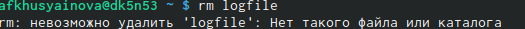{ #fig:0010 width=70% }

8. Запускаем редактор gedit в фоновом режиме командой «gedit&»  После этого на экране появляется окно редактора.

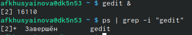{ #fig:0012 width=70% }

9. Чтобы определить идентификатор процесса gedit, используем команду «ps| grep-i“gedit”», чтобы узнать идентификатор процесса можно использовать команду «pgrep gedit»или «pidof gedit».

{ #fig:0012 width=70% }

10. Прочитав информацию о команде kill с помощью команды «man kill», используем её для завершения процесса gedit

{ #fig:0013 width=70% }

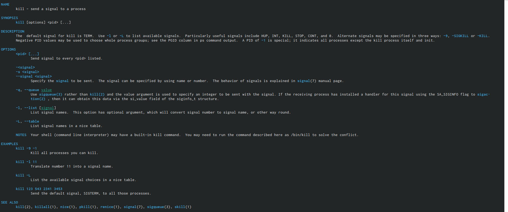{ #fig:0014 width=70% }

11. C помощью команд «man df» и «man du» узнаем информацию по необходимым командам и далее использую их.

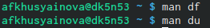{ #fig:0015 width=70% }

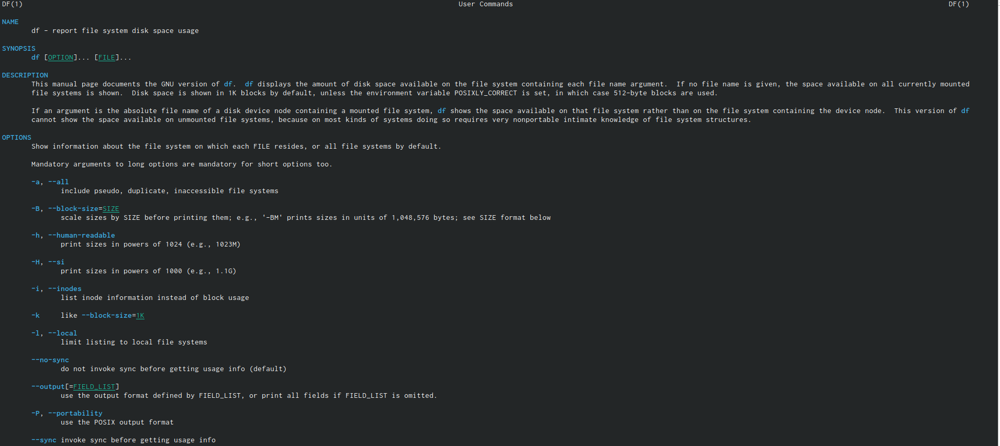{ #fig:0016 width=70% }

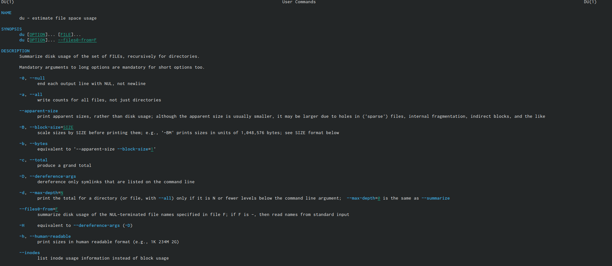{ #fig:0017 width=70% }

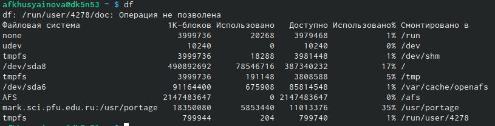{ #fig:0018 width=70% }

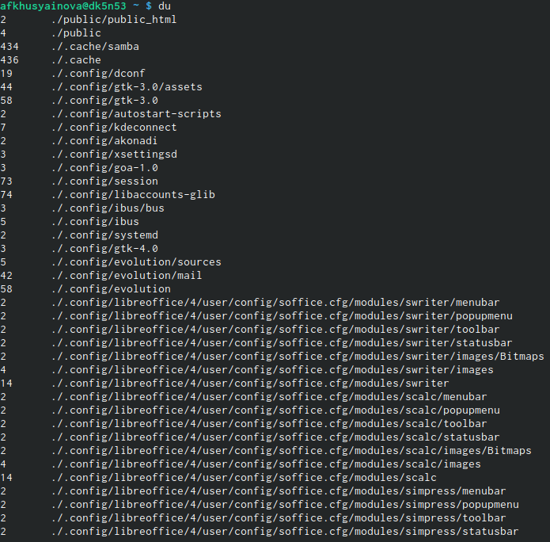{ #fig:0019 width=70% }

df – утилита, показывающая список всех файловых систем по именам устройств, сообщает их размер, занятое и свободное пространство и точки монтирования. Синтаксис: df[опции] устройств. 
du – утилита, предназначенная для вывода информации об объеме дискового пространства, занятого файлами и директориями. Она принимает путь к элементу файловой системы и выводит информацию о количестве байт дискового пространства или блоков диска, задействованных для его хранения. Синтаксис: du [опции] каталог_или_файл

12. Выводим имена всех директорий, имеющихся в моем домашнем каталоге с помощью команды «find~ -typed», до этого получаем информацию с помощью команды «man find» 

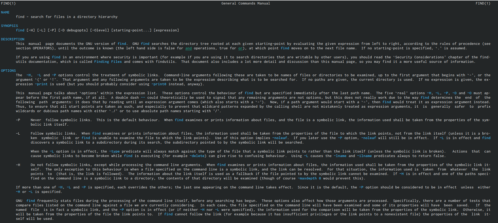{ #fig:0020 width=70% }

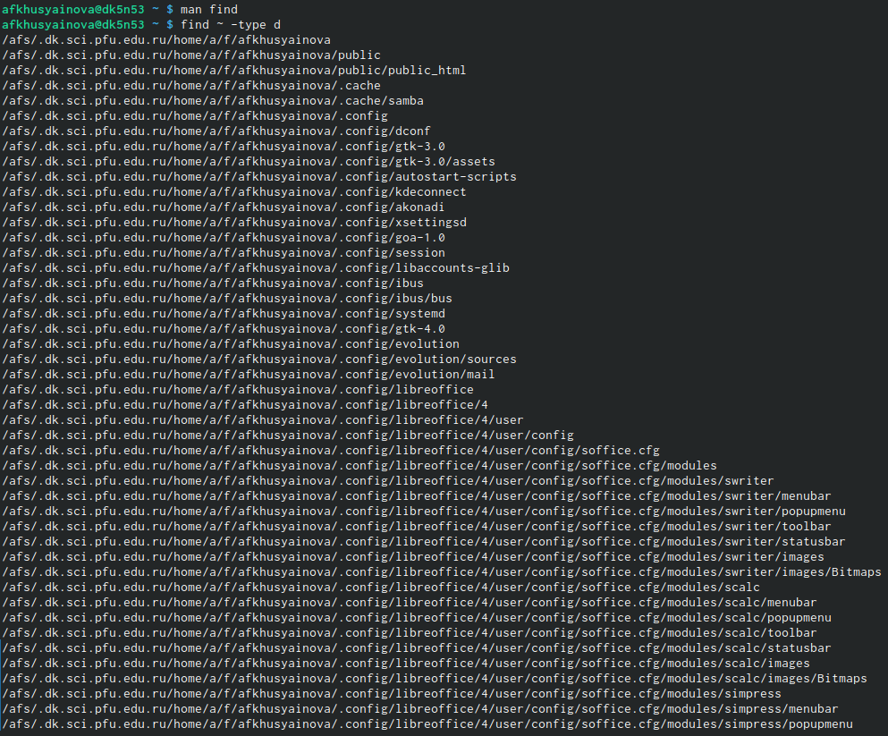{ #fig:0021 width=70% }

#Выводы

Я ознакомилась с инструментами поиска файлов и фильтрации текстовых данных, приобрела практические навыки: по управлению процессами (и заданиями), по проверке использования диска и обслуживанию файловых систем.
 
# Контрольные вопросы

1). В системе по умолчанию открыто три специальных потока:
–stdin − стандартный поток ввода (по умолчанию: клавиатура), файловый дескриптор 0;
–stdout − стандартный поток вывода (по умолчанию: консоль), файловый дескриптор 1;
-stderr − стандартный поток вывод сообщений об ошибках (поумолчанию: консоль), файловый дескриптор 2.
Большинство используемых в консоли команд и программ записывают результаты своей работы в стандартный поток вывода stdout.
2). ‘>’ Перенаправление вывода в файл
‘»’ Перенаправление вывода в файл и открытие файла в режиме добавления (данные добавляются в конец файла)/
3). Конвейер (pipe) служит для объединения простых команд или утилит в цепочки, в которых результат работы предыдущей команды передаётся последующей.
Синтаксис следующий:
команда1|команда2 (это означает, что вывод команды 1 передастся на ввод команде 2)
4). Процесс рассматривается операционной системой как заявка на потребление всех видов ресурсов, кроме одного − процессорного времени. Этот последний важнейший ресурс распределяется операционной системой между другими единицами работы − потоками, которые и получили свое название благодаря тому, что они представляют собой последовательности (потоки выполнения) команд.
Процесс − это выполнение программы. Он считается активной сущностью и реализует действия, указанные в программе.
Программа представляет собой статический набор команд, а процесс это набор ресурсов и данных, использующихся при выполнении программы.
5). pid: идентификатор процесса (PID) процесса (processID), к которому вызывают метод
gid: идентификатор группы UNIX, в котором работает программа.
6). Любую выполняющуюся в консоли команду или внешнюю программу можно запустить в фоновом режиме. Для этого следует в конце имени команды указать знак амперсанда &.
Запущенные фоном программы называются задачами (jobs). Ими можно управлять с помощью команды jobs, которая выводит список запущенных в данный момент задач.
7). top − это консольная программа, которая показывает список работающих процессов в системе. Программа в реальном времени отсортирует запущенные процессы по их нагрузке на процессор.
htop − это продвинутый консольный мониторинг процессов. Утилита выводит постоянно меняющийся список системных процессов, который сортируется в зависимости от нагрузки на ЦПУ. Если делать сравнение сtop, то htop показывает абсолютно все процессы в системе, время их непрерывного использования, загрузку процессоров и расход оперативной памяти.
8). find − это команда для поиска файлов и каталогов на основе специальных условий. Ее можно использовать в различных обстоятельствах, например, для поиска файлов по разрешениям, владельцам, группам, типу, размеру и другим подобным критериям.
Команда find имеет такой синтаксис:
find[папка][параметры] критерий шаблон [действие]
Папка − каталог в котором будем искать
Параметры − дополнительные параметры, например, глубина поиска, и т д.
Критерий − по какому критерию будем искать: имя, дата создания, права, владелец и т д.
Шаблон – непосредственно значение по которому будем отбирать файлы.
Основные параметры:
-P никогда не открывать символические ссылки
-L - получает информацию о файлах по символическим ссылкам. Важно для дальнейшей обработки, чтобы обрабатывалась не ссылка, а сам файл.
-maxdepth - максимальная глубина поиска по подкаталогам,для поиска только в текущем каталоге установите 1.
-depth - искать сначала в текущем каталоге, а потом в подкаталогах
-mount искать файлы только в этой файловой системе.
-version - показать версию утилиты find
-print - выводить полные имена файлов
-typef - искать только файлы
-typed - поиск папки в Linux
Основные критерии:
-name - поиск файлов по имени
-perm - поиск файлов в Linux по режиму доступа
-user - поиск файлов по владельцу
-group - поиск по группе
-mtime - поиск по времени модификации файла
-atime - поиск файлов по дате последнего чтения
-nogroup - поиск файлов, не принадлежащих ни одной группе
-nouser - поиск файлов без владельцев
-newer - найти файлы новее чем указанный
-size - поиск файлов в Linux по их размеру
Примеры:
find~ -type d поиск директорий в домашнем каталоге
find~ -type f -name ".*" поиск скрытых файлов в домашнем каталоге
9). Файл по его содержимому можно найти с помощью команды grep: «grep -r" слово/выражение, которое нужно найти"».
10). Утилита df, позволяет проанализировать свободное пространство на всех подключенных к системе разделах.
11). При выполнении команды du (без указания папки и опции) можно получить все файлы и папки текущей директории с их размерами. Для домашнего каталога: du ~/
12). Основные сигналы (каждый сигнал имеет свой номер), которые используются для завершения процесса:
SIGINT–самый безобидный сигнал завершения, означает Interrupt. Он отправляется процессу, запущенному из терминала с помощью сочетания клавиш Ctrl+C. Процесс правильно завершает все свои действия и возвращает управление;
SIGQUIT–это еще один сигнал, который отправляется с помощью сочетания клавиш, программе, запущенной в терминале. Он сообщает ей что нужно завершиться и программа может выполнить корректное завершение или проигнорировать сигнал. В отличие от предыдущего, она генерирует дамп памяти. Сочетание клавиш Ctrl+/;
SIGHUP–сообщает процессу, что соединение с управляющим терминалом разорвано, отправляется, в основном, системой при разрыве соединения с интернетом;
SIGTERM–немедленно завершает процесс, но обрабатывается программой, поэтому позволяет ей завершить дочерние процессы и освободить все ресурсы;
SIGKILL–тоже немедленно завершает процесс, но, в отличие от предыдущего варианта, он не передается самому процессу, а обрабатывается ядром. Поэтому ресурсы и дочерние процессы остаются запущенными.
Также для передачи сигналов процессам в Linux используется утилита kill, её синтаксис: kill [-сигнал] [pid_процесса] (PID – уникальный идентификатор процесса). Сигнал представляет собой один из выше перечисленных сигналов для завершения процесса. Перед тем, как выполнить остановку процесса, нужно определить его PID. Для этого используют команды ps и grep. Команда ps предназначена для вывода списка активных процессов в системе и информации о них. Команда grep запускается одновременно с ps (вканале) и будет выполнять поиск по результатам команды ps.
Утилита pkill – это оболочка для kill, она ведет себя точно так же, и имеет тот же синтаксис, только в качестве идентификатора процесса ей нужно передать ег оимя.
killall работает аналогично двум предыдущим утилитам. Она тоже принимает имя процесса в качестве параметра и ищет его PID в директории /proc. Но эта утилита обнаружит все процессы с таким именем и завершит их.

