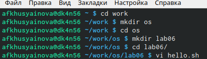
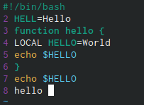

---
## Front matter
lang: ru-RU
title: Лабораторная работа №8
author: Хусяинова Адиля Фаритовна
institute: \inst{1}RUDN University, Moscow, Russian Federation

## Formatting
toc: false
slide_level: 2
theme: metropolis
aspectratio: 43
section-titles: true
---

# Отчет по лабораторной работе №8

# Создание каталога

 - Создала каталог с именем ~/work/os/lab06 (РИС.1)
 
{ #fig:001 width=70% }

# Редактор vi

Данный редактор имеет три режима работы:
 - Режим последней строки - используется для записи изменений в файле и выхода из редактора.
 
 - Режим вставки - с помощью него возможно ввод содержания редактируемого файла.
 
 - Командный режим - используется для ввода команд редактирования и навигации по редактируемому файлу.

# Создание файла

 - Открываем файл в редакторе vi, далее в режиме вставки напечатаем текст.
 
 - Переходим в режим последней строки, сохраняем файл и выходим из него.
 
{ #fig:002 width=70% } 
 
# Редактирование файла 

 - С помощью сочетаний клавиш в клавиатуре осуществляется редактирование файла через командный режим. В процессе выполнения я использовала различные команды, изучив их в теоретической части лабораторной работы(Отмена посленего действия, втавка, удаление и т.д.)

# Вывод

В ходе данной лабораторной работе я ознакомилась с операционной системой Linux. Получила практические навыки работы с редактором vi
