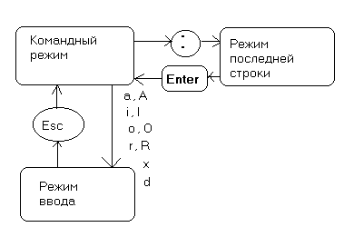

---
## Front matter
title: "Лабораторная работа №8"
subtitle: "Отчет по лабораторной работе"
author: "Хусяинова Адиля Фаритовна"

## Generic otions
lang: ru-RU

## Pdf output format
toc-depth: 2
fontsize: 12pt
linestretch: 1.5
papersize: a4
documentclass: scrreprt
## I18n polyglossia
polyglossia-lang:
  name: russian
  options:
	- spelling=modern
	- babelshorthands=true
polyglossia-otherlangs:
  name: english
## I18n babel
babel-lang: russian
babel-otherlangs: english
## Fonts
mainfont: PT Serif
romanfont: PT Serif
sansfont: PT Sans
monofont: PT Mono
mainfontoptions: Ligatures=TeX
romanfontoptions: Ligatures=TeX
sansfontoptions: Ligatures=TeX,Scale=MatchLowercase
monofontoptions: Scale=MatchLowercase,Scale=0.9
## Biblatex
biblatex: true
biblio-style: "gost-numeric"
biblatexoptions:
  - parentracker=true
  - backend=biber
  - hyperref=auto
  - language=auto
  - autolang=other*
  - citestyle=gost-numeric
## Pandoc-crossref LaTeX customization
figureTitle: "Рис."
tableTitle: "Таблица"
listingTitle: "Листинг"
lofTitle: "Список иллюстраций"
lotTitle: "Список таблиц"
lolTitle: "Листинги"
## Misc options
indent: true
header-includes:
  - \usepackage{indentfirst}
  - \usepackage{float} # keep figures where there are in the text
  - \floatplacement{figure}{H} # keep figures where there are in the text
---

# Цель работы

Познакомиться с операционной системой Linux, получить практические навыки работы с редактором vi, установленным по умолчанию практически во всех дистрибутивах.

# Задание

1. Создание нового файла с использованием vi

2. Редактирование существующего файла

# Выполнение лабораторной работы

1. Создадим каталог с именем ~/work/os/lab06, далее перейдем в него(рис.1)

{ #fig:001 width=70% }

2. Вызовим vi и создадим файл hello.sh, воспользовавшись командой vi hello.sh. Файл создается по умолчанию редактором

3. Нажмем клавишу i и перейдем в режим вставки, далее введем предложенный нам текст(рис.2)

{ #fig:002 width=70% }

4. Нажмем клавишу Esc для перехода в командный режим, далее вводи символ ":" для перехода в режим последней строки. После нажимаем клавишу w(записать), q(выйти). В конце нажимаем клавишу Enter, для того чтобы сохранить файл и выйти(рис.3)

{ #fig:003 width=70% }

5. Сделаем файл исполняемым, воспользовавшись командой  chmod +x hello.sh(рис.4)

{ #fig:004 width=70% }

- Редакирование существующего файла

1. Вызовите vi для редактирование файла

2. Установим курсор в конец слова HELL второй строки, перейдем в режим вставки и заменим на HELLO. Команда используемая для замены слова, клавиши "c" и "w". Далее нажмем Esc для возврата в командный режим.

- Установим курсор на четвертую строку и сотрtv слово LOCAL, перейдем в режим вставки и наберем local, нажмем Esc для возврата в командный режим.

- Установим курсор на последней строке файла. Вставим после неё строку, содержащую следующий текст: echo $HELLO. Для этого скопируем седьмую строку, воспользовавшись клавишей 'Y', вставляем ее в последнюю строку клавишей 'p' (рис.5)

{ #fig:005 width=70% }

3. Перейдя в командный режим, удаляем последнюю строку, для этого дважды нажимаем клавишу 'd' (рис.6)

{ #fig:006 width=70% }

- Введем команду отмены последнего действия, с помощью клавишу 'u' (рис.7)

{ #fig:007 width=70% }

4. Введем символ ":" для перехода в режим последней строки. Запишим произведённые изменения и выйдем из редактора vi (рис.8)

{ #fig:008 width=70% }

# Выводы

Я познакомилась с операционной системой Linux, получила практические навыки работы с редактором vi.

# Контрольные вопросы

1. Редактор vi имеет три режима работы:
командный режим − предназначен для ввода команд редактирования и навигации по редактируемому файлу;
режим вставки − предназначен для ввода содержания редактируемого файла;
режим последней (или командной) строки − используется для записи изменений в файл и выхода из редактора.
2. Чтобы выйти из редактора, не сохраняя произведённые изменения, нужно в режиме командной строки нажать клавиши «:» «q» «!»
3. Команды позиционирования:
«0»(ноль) − переход в начало строки;
4. При использовании прописных W и B под разделителями понимаются только пробел, табуляция и возврат каретки. При использовании строчных w и b под разделителями понимаются также любые знаки пунктуации.
5. Чтобы из любого места редактируемого файла перейти в начало (конец) файла, нужно в режиме командной строки нажать клавиши «1» «G» («G»).
6. Команды редактирования:
Вставка текста «а» − вставить текст после курсора;
 - «А» − вставить текст в конец строки;
 - «i» − вставить текст перед курсором;
 - n «i» − вставить текст n раз;
 - «I» − вставить текст в начало строки.
Вставка строки «о» − вставить строку под курсором;
 - «О» − вставить строку над курсором.
Удаление текста «x» − удалить один символ в буфер;
 - «d» «w» − удалить одно слово в буфер;
 - «d» «$» − удалить в буфер текст от курсора до конца строки;
 - «d» «0» − удалить в буфер текст от начала строки до позиции курсора;
 - «d» «d» − удалить в буфер одну строку;
 - n «d» «d» − удалить в буфер n строк.
Отмена и повтор произведённых изменений «u» − отменить последнее изменение;
 - «.» − повторить последнее изменение.
 - Копирование текста в буфер «Y» − скопировать строку в буфер;
 - n «Y» − скопировать n строк в буфер;
 - «y» «w» − скопировать слово в буфер.
Вставка текста из буфера «p» − вставить текст из буфера после курсора;
 - «P» − вставить текст из буфера перед курсором.
 - Замена текста «c» «w» − заменить слово;
 - n «c» «w» − заменить nслов;
 - «c» «$» − заменить текст от курсора до конца строки;
 - «r» − заменить слово;
 - «R» − заменить текст.
Поиск текста «/» текст − произвести поиск вперёд по тексту указанной строки символов текст;
 - «?» текст − произвести поиск назад по тексту указанной строки символов текст.
Копирование и перемещение текста «:» n,m «d» – удалить строки с n по m;
 - «:» i,j «m» k – переместить строки с i по j, начиная со строки k;
 - «:» i,j «t» k – копировать строки с i по j в строку k;
 - «:» i,j «w» имя-файла – записать строки с i по j в файл с именем имя-файла.
7. Чтобы заполнить строку символами », чтобы заменить текст от курсора до конца строки, и ввести символы $.
8. Чтобы отменить по одному предыдущему действию последовательно, необходимо нажать «u». Чтобы отменить все изменения, произведённые со времени последней записи, нужно нажать «:» «e» «!».
9. Команды редактирования в режиме командной строки
Копирование и перемещение текста «:»n,m «d» − удалить строки с n по m;
 - «:»i,j «m» k − переместить строки с i по j, начиная со строки k;
 - «:»i,j «t» k − копировать строки с i по j в строку k;
 - «:»i,j «w» имя-файла − записать строки с i по j в файл с именем имя-файла.
Запись в файл и выход из редактора «:» «w» − записать изменённый текст в файл, не выходя из vi;
 - «:» «w» имя-файла − записать изменённый текст в новый файл с именем имя-файла;
 - «:» «w» «!» имя-файла − записать изменённый текст в файл с именем имя-файла;
 - «:» «w» «q» − записать изменения в файл и выйти из vi;
 - «:» «q» − выйти из редактора vi;
 - «:» «q» «!» − выйти из редактора без записи;
 - «:» «e» «!» − вернуться в командный режим, отменив все изменения, произведённые со времени последней записи.
Опции Опции редактора vi позволяют настроить рабочую среду. Для задания опций используется команда set (в режиме последней строки):
 - «:»set all − вывести полный список опций;
 - «:»set nu − вывести номера строк;
 - «:»set list − вывести невидимые символы;
 - «:»set ic − не учитывать при поиске, является ли символ прописным или строчным.
Если вы хотите отказаться от использования опции, то в команде set перед именем опции надо поставить no.
10. Чтобы определить, не перемещая курсора, позицию, в которой заканчивается строка, нужно в командном режиме находясь на нужной строке нажать «$»и посмотреть на число после запятой в правом нижнем углу экрана.
11. Опции редактора vi позволяют настроить рабочую среду. Для задания опций используется команда set (в режиме командной строки). Если вы хотите отказаться от использования опции, то в команде set перед именем опции надо поставить no. Чтобы просмотреть опции редактора vi, необходимо нажать «:» set all. Нажав «:» help “название_опции”, можно узнать назначение конкретной опции.
12. В режиме командной строки внизу редактора присутствует «:», в режиме ввода – «–ВСТАВКА –», в командном режиме внизу ничего нет.
13. Граф взаимосвязи режимов работы редактора vi:

{ #fig:009 width=70% }

