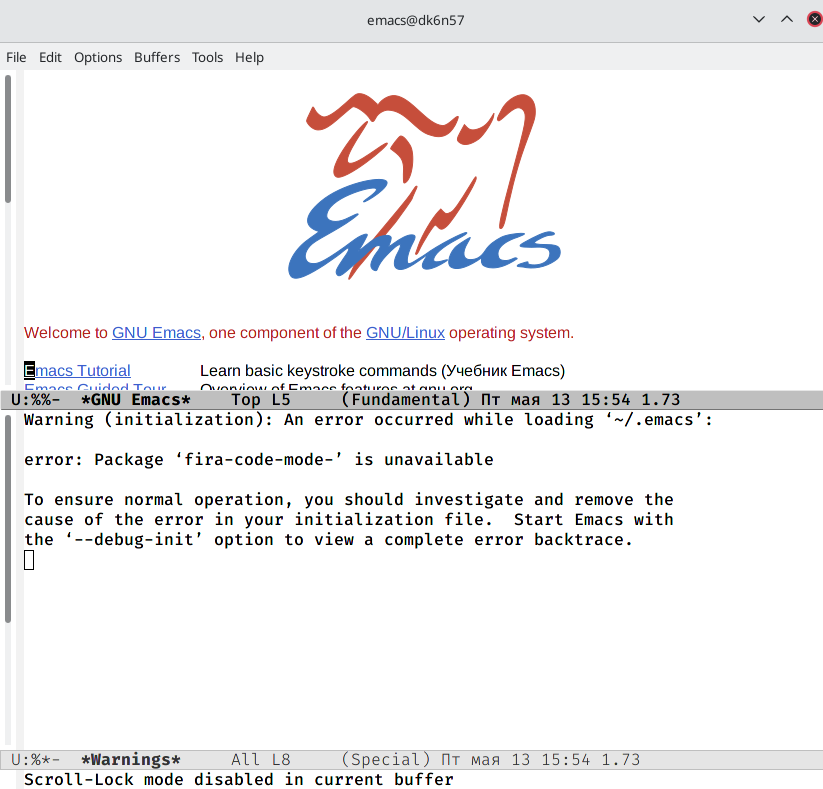
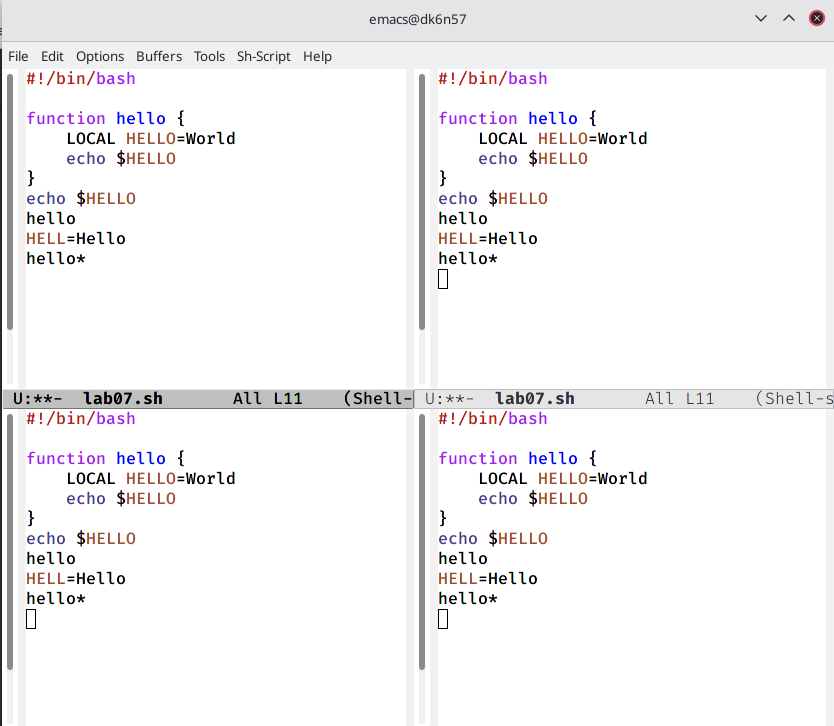

---
## Front matter
lang: ru-RU
title: Лабораторная работа №9
author: Хусяинова Адиля Фаритовна
institute: \inst{1}RUDN University, Moscow, Russian Federation

## Formatting
toc: false
slide_level: 2
theme: metropolis
aspectratio: 43
section-titles: true
---

# Отчет по лабораторной работе №9

# Буфер emacs

- Буфер, представляет из себя основную еденицу редактирования. При работе с файлами буфер означает "копию файла, находящуюся в памяти в данный момент". Буфер например содержит встроенные подсказки, результаты компиляции программы и т.д. (рис.1)

{ #fig:001 width=70% }

# Работа в редакторе

- Чтобы запустить редактор, необходимо в командной строке консоли набрать emacs &. Чтобы работать с emacs воспользуемся  сочетаниями различных клавиш, также используем элементы меню

# Работа с фреймом

- Поделим фрейм на четыре части, воспользовавшись командой (Ctrl-x 3) (рис.2)

{ #fig:0019 width=70% }

# Редактирование файла

 - Вставка
 - Удаление и т.д

# Выводы

- В ходе выполнения данной лабораторной работы Я ознакомилась с операционной системой Linux, также получила практические навыки работы с редактором Emax

