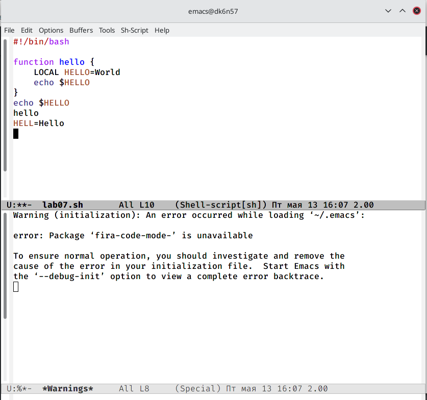

---
## Front matter
title: "Лабораторная работа №9"
subtitle: "Отчет по лабораторной работе"
author: "Хусяинова Адиля Фаритовна"

## Generic otions
lang: ru-RU

## Pdf output format
toc-depth: 2
fontsize: 12pt
linestretch: 1.5
papersize: a4
documentclass: scrreprt
## I18n polyglossia
polyglossia-lang:
  name: russian
  options:
	- spelling=modern
	- babelshorthands=true
polyglossia-otherlangs:
  name: english
## I18n babel
babel-lang: russian
babel-otherlangs: english
## Fonts
mainfont: PT Serif
romanfont: PT Serif
sansfont: PT Sans
monofont: PT Mono
mainfontoptions: Ligatures=TeX
romanfontoptions: Ligatures=TeX
sansfontoptions: Ligatures=TeX,Scale=MatchLowercase
monofontoptions: Scale=MatchLowercase,Scale=0.9
## Biblatex
biblatex: true
biblio-style: "gost-numeric"
biblatexoptions:
  - parentracker=true
  - backend=biber
  - hyperref=auto
  - language=auto
  - autolang=other*
  - citestyle=gost-numeric
## Pandoc-crossref LaTeX customization
figureTitle: "Рис."
tableTitle: "Таблица"
listingTitle: "Листинг"
lofTitle: "Список иллюстраций"
lotTitle: "Список таблиц"
lolTitle: "Листинги"
## Misc options
indent: true
header-includes:
  - \usepackage{indentfirst}
  - \usepackage{float} # keep figures where there are in the text
  - \floatplacement{figure}{H} # keep figures where there are in the text
---

# Цель работы

Познакомиться с операционной системой Linux. Получить практические навыки работы с редактором Emacs

# Выполнение лабораторной работы

1. Открываем emacs черезкомандную строку emacs&(рис.1)

{ #fig:001 width=70% }

2. Создаем файл lab07.sh с помощью комбинации Ctrl-x Ctrl-f(рис.2)

{ #fig:002 width=70% }

3. Набираем предложенный текст и сохраняем файл с помощью комбинации Ctrl-x Ctrl-s (рис.3)

{ #fig:003 width=70% }

4. Редактируем текст
 - Вырежем одной командой целую строку с помощью команды(Сtrl-k).

{ #fig:004 width=70% }
 
 - Вставим эту строку в конец файла (Ctrl-y).

{ #fig:005 width=70% }
 
 - Выделим область текста (Ctrl-space) и скопируем область в буфер обмена (Alt-w).

{ #fig:006 width=70% }
 
 -  Вставим область в конец файла(Ctrl-y)

{ #fig:007 width=70% }
 
 -  Вновь выделим эту область и на этот раз вырежем её (Ctrl-w).

{ #fig:008 width=70% }
 
 -  Отменим последнее действие (Ctrl-/).

{ #fig:009 width=70% }
 
5. Научимся использовать команды по перемещению курсора.
 - Переместим курсор в начало строки (Ctrl-a).

{ #fig:0010 width=70% }
 
 - Переместим курсор в конец строки (Ctrl-e).

{ #fig:0011 width=70% }
 
 - Переместим курсор в начало буфера (Alt-<).

{ #fig:0012 width=70% }
 
 - Переместим курсор в конец буфера (Alt->).

{ #fig:0013 width=70% }
   
6. Управление буферами.

 - Выведем список активных буферов на экран (Ctrl-x Ctrl-b).

{ #fig:0014 width=70% }

 - Переместимся во вновь открытое окно (Ctrl-x) со списком открытых буферов и переключимся на другой буфер.

{ #fig:0015 width=70% }
 
 - Закроем это окно (Ctrl-x 0).

{ #fig:0016 width=70% }
 
 - Теперь вновь переключаемся между буферами, но уже без вывода их списка на
экран (Ctrl-x b).

{ #fig:0017 width=70% }

7. Управление окнами.

 - Поделим фрейм на 4 части: разделим фрейм на два окна по вертикали (Ctrl-x 3), а затем каждое из этих окон на две части по горизонтали (Ctrl-x 2). В каждом из четырёх созданных окон откроем новый буфер (файл) и введим несколько строк текста.
 
{ #fig:0018 width=70% } 

{ #fig:0019 width=70% }

{ #fig:0020 width=70% }

8. Режим поиска

 - Переключимся в режим поиска (Ctrl-s) и найдем несколько слов, присутствующих в тексте.

{ #fig:0021 width=70% }
 
 - Переключимся между результатами поиска, нажимая (Ctrl-s).

{ #fig:0022 width=70% }
 
 - Выйдим из режима поиска, нажав (Ctrl-g).

{ #fig:0023 width=70% }

 - Перейдием в режим поиска и замены (Alt-%), введем текст, который следует найти и заменить, нажмем Enter , затем введем текст для замены. После того как будут подсвечены результаты поиска, нажмем ! для подтверждения замены.

{ #fig:0024 width=70% } 

 - Испробуем другой режим поиска, нажав (Alt-s)

{ #fig:0025 width=70% }

# Выводы

Я приобрела практические навыки в работе с редактором emacs

# Контрольные вопросы

1. Emacs − один из наиболее мощных и широко распространённых редакторов, используемых в мире Unix. По популярности он соперничает с редактором vi и его клонами. В зависимости от ситуации, Emacs может быть текстовым редактором; программой для чтения почты и новостей Usenet; интегрированной средой разработки (IDE); операционной системой и т.д.Всё это разнообразие достигается благодаря архитектуре Emacs, которая позволяет расширять возможности редактора при помощи языка Emacs Lisp. На языке C написаны лишь самые базовые и низкоуровневые части Emacs, включая полнофункциональный. интерпретатор языка Lisp. Таким образом, Emacs имеет встроенный язык программирования, который может использоваться для настройки, расширения и изменения поведения редактора. В действительности, большая часть того редактора, с которым пользователи Emacs работают в наши дни,написана на языке Lisp.
2. Основную трудность для новичков при освоенииданного редактора могутсоставлять большое количество команд, комбинаций клавиш, которые не получится все запомнить с первого раза и поэтоупридется часто обращаться к справочным материалам.
3. Буфер –это объект, представляющий собой текст. Если имеется несколько буферов, то редактировать можно только один. Обычно буфер считывает данные из файла или записывает в файл данные из буфера.Окно –это область экрана, отображающая буфер. При запуске редактора отображается одно окно, но при обращении к некоторым функциям могут открыться дополнительные окна. Окна Emacsи окна графической среды XWindow–разные вещи. Одно окно XWindowможет быть разбито на несколько окон в смысле Emacs, в каждом из которых отображается отдельный буфер.
4. Да, можно.
5. При запуске Emacsпо умолчанию создаются следующие буферы: «scratch»(буфер для несохраненного текста) «Messages»(журнал ошибок, включающий такжеинформацию, которая появляется в области EchoArea) «GNUEmacs»(справочный буфер о редакторе).
6. C-c |сначала, удерживая «ctrl»,нажимаю «c»,после –отпускаюобе клавишии нажимаю «|» C-cC-|сначала, удерживая «ctrl»,нажимаю «с», после –отпускаю обе клавиши и, удерживая «ctrl», нажимаю «|».
7. Чтобы поделить окно на две части необходимо воспользоваться комбинацией «Ctrl-x 3»(по вертикали) или «Ctrl-x 2» (по горизонтали).
8. Настройки Emacsхранятся в файле .emacs.
9. По умолчанию клавиша «←» удаляет символперед курсором, нов редакторе её можно переназначить. Для этого необхдимоизменить конфигурацию файла .emacs.
10. Более удобным я считаю редактор emacs, потому чтов нем проще открывать другие файлы, можно использовать сразу несколько окон, нет «Командногорежима», «Режима ввода», «Режима командной строки», которые являются немного непривычными и в какой-то степени неудобным.

