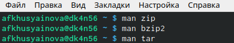
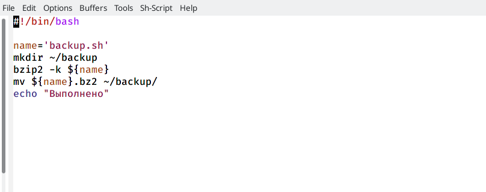
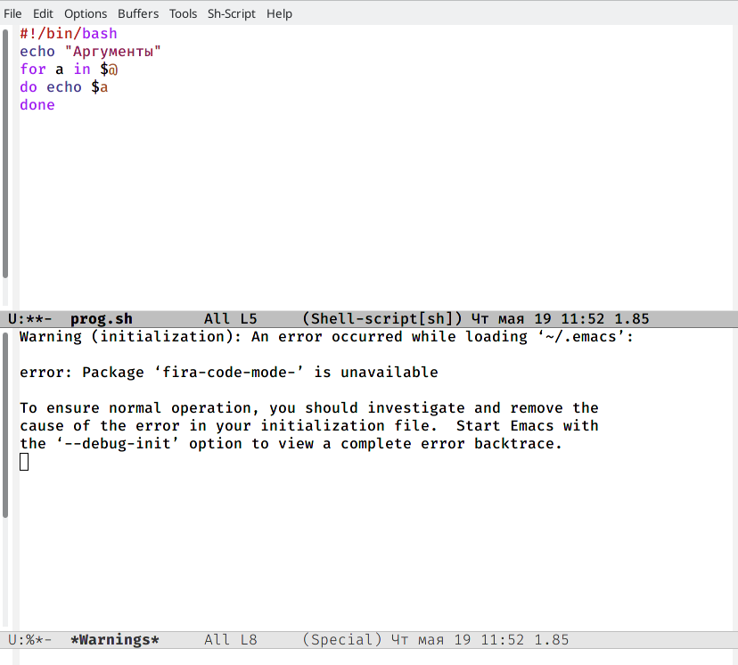
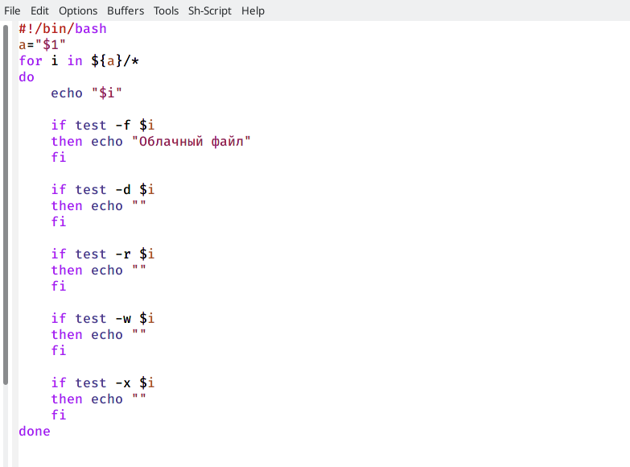
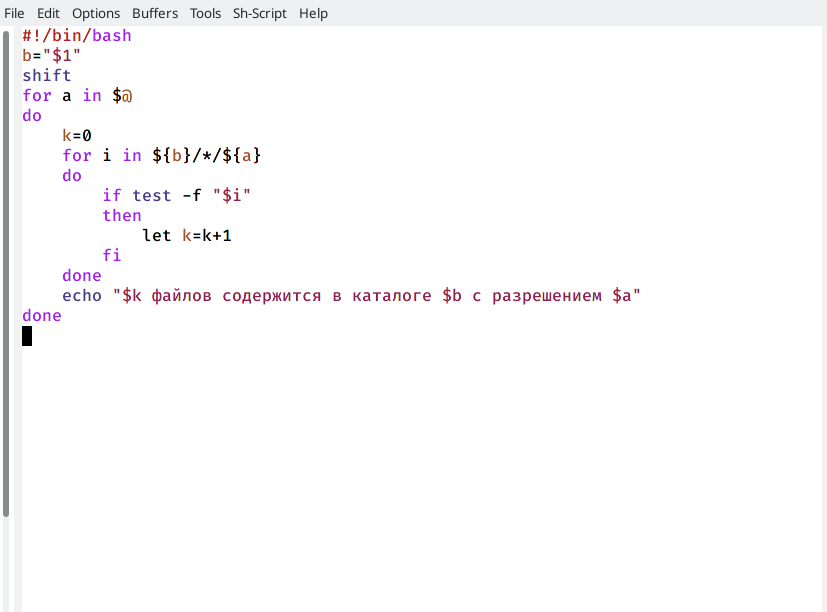

---
## Front matter
lang: ru-RU
title: Лабораторная работа №10
author: Хусяинова Адиля Фаритовна
institute: \inst{1}RUDN University, Moscow, Russian Federation

## Formatting
toc: false
slide_level: 2
theme: metropolis
header-includes: 
aspectratio: 43
section-titles: true
---

# Работа с консолью

 - Я изучила команды архивации, используя команды man zip, man bzip2, man tar (рис.1)

{ #fig:001 width=70% }

# Первая программа

 - Резервная копия самого себя (рис.2)
 
{ #fig:006 width=70% } 
 
# Вторая программа

 - Выводы аргументов (рис.3)
 
{ #fig:0011 width=70% }

# Третья программа

 - Команда-замена ls (рис.4)

{ #fig:0014 width=70% }

# Четвертая программа

 - Поиск файлов (рис.5)

{ #fig:0017 width=70% }

# Выводы 

 - В ходе данной лабораторной работы я ознакомилась с основами в оболочке OC UNIX/Linux, также я научилась писать небольшие командные файлы 
