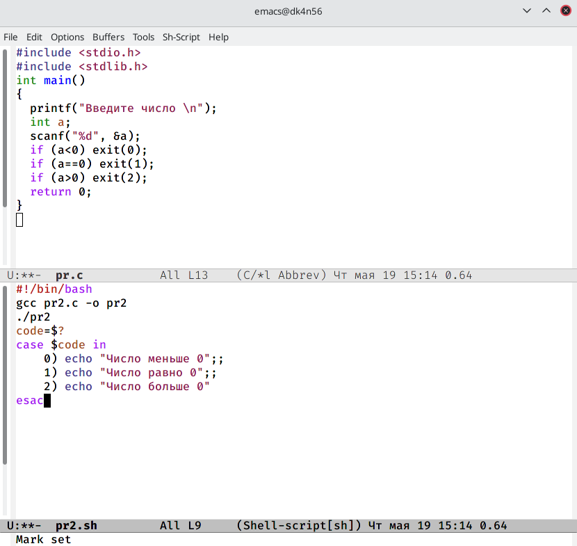
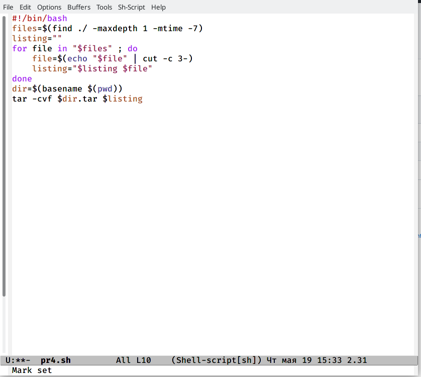

---
## Front matter
lang: ru-RU
title: Лабораторная работа №11
author: Хусяинова Адиля Фаритовна
institute: \inst{1}RUDN University, Moscow, Russian Federation

## Formatting
toc: false
slide_level: 2
theme: metropolis
header-includes: 
aspectratio: 43
section-titles: true
---

# Программа на Си

 - Программа выводит число и определяет, является ли оно больше нуля, меньше нуля или равно нулю.Затем завершаем программу с помощью функции exit(n), передавая информацию о коде завершения в оболочку 
 
{ #fig:005 width=70% }

# Скрипты для работы с командой tar

{ #fig:0010 width=70% }

# Выводы

 - В ходе данной лабораторной работы я изучила основы программирования в оболочке ОС Linux, научилась писать небольшие командные файлы
