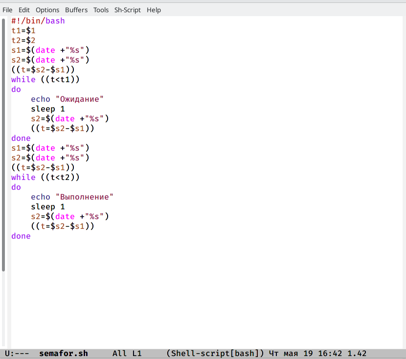
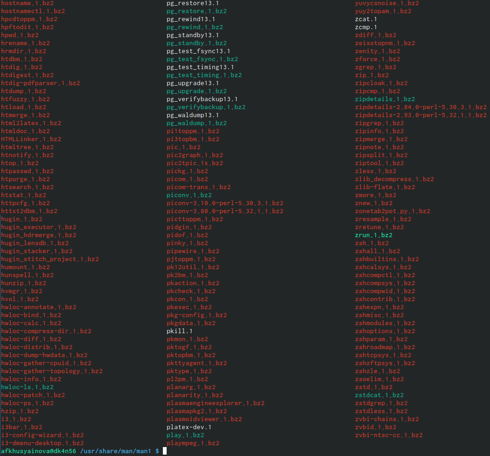
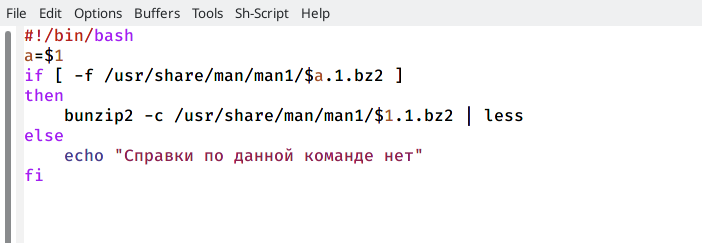
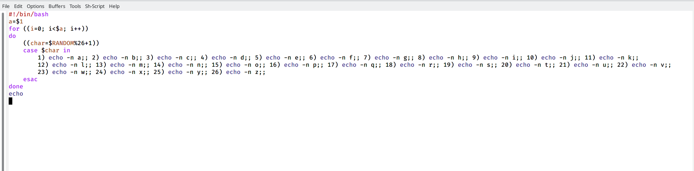

---
## Front matter
lang: ru-RU
title: Лабораторная работа №12
author: Хусяинова Адиля Фаритовна
institute: \inst{1}RUDN University, Moscow, Russian Federation

## Formatting
toc: false
slide_level: 2
theme: metropolis
header-includes:
aspectratio: 43
section-titles: true
---

# Первый скрипт 

 - Написала командный файл, реализующий механизм семафоров (рис.1)
 
{ #fig:002 width=70% }

# Реализация команды man

 - Реализовала команду man с помощью командного файла (рис.2)

{ #fig:006 width=70% }

# Второй скрипт

 - Содержит справку по установленным в системе программ и команд, открывает архивы текстовых файлов (рис.3)
 
{ #fig:007 width=70% }

# Скрипт №3

 - Написала командный файл,генерирующий случайную последовательность букв латинского алфавита (рис.4)
 
{ #fig:0013 width=70% }

# Выводы
 - В процессе выполнения данной лабораторной работе я изучила основы программирования в оболочке UNIX, научилась писать более сложные командные файлы.

