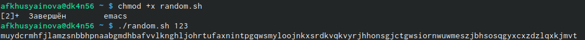

---
## Front matter
title: "Лабораторная работа №12"
subtitle: "Отчет по лабораторной работе "
author: "Хусяинова Адиля Фаритовна"

## Generic otions
lang: ru-RU
toc-title: "Содержание"

## Pdf output format
toc-depth: 2
fontsize: 12pt
linestretch: 1.5
papersize: a4
documentclass: scrreprt
## I18n polyglossia
polyglossia-lang:
  name: russian
  options:
	- spelling=modern
	- babelshorthands=true
polyglossia-otherlangs:
  name: english
## I18n babel
babel-lang: russian
babel-otherlangs: english
## Fonts
mainfont: PT Serif
romanfont: PT Serif
sansfont: PT Sans
monofont: PT Mono
mainfontoptions: Ligatures=TeX
romanfontoptions: Ligatures=TeX
sansfontoptions: Ligatures=TeX,Scale=MatchLowercase
monofontoptions: Scale=MatchLowercase,Scale=0.9
## Biblatex
biblatex: true
biblio-style: "gost-numeric"
biblatexoptions:
  - parentracker=true
  - backend=biber
  - hyperref=auto
  - language=auto
  - autolang=other*
  - citestyle=gost-numeric
## Pandoc-crossref LaTeX customization
figureTitle: "Рис."
tableTitle: "Таблица"
listingTitle: "Листинг"
lofTitle: "Список иллюстраций"
lotTitle: "Список таблиц"
lolTitle: "Листинги"
## Misc options
indent: true
header-includes:
  - \usepackage{indentfirst}
  - \usepackage{float} # keep figures where there are in the text
  - \floatplacement{figure}{H} # keep figures where there are in the text
---

# Цель работы

Изучить основы программирования в оболочке ОС UNIX. Научиться писать более сложные командные файлы с использованием логических управляющих конструкций и циклов.

# Выполнение лабораторной работы

1. Напишем командный файл, реализующий упрощённый механизм семафоров. Командный файл должен в течение некоторого времени t1 дожидаться освобождения ресурса, выдавая об этом сообщение, а дождавшись его освобождения, использовать его в течение некоторого времени t2<>t1, также выдавая информацию о том, что ресурс используется соответствующим командным файлом (процессом).
Для выполнения данной задачи создадим файл semafor.sh и откроем его в emacs (рис.1)

{ #fig:001 width=70% }

 - В файле напишем соответствующий скрипт (рис.2) и проверим его работу (команда ./semafor.sh 2 4), предварительно добавив права на выполнение (команда chmod +x semafor.sh) (рис.2-3)

{ #fig:001 width=70% }

{ #fig:001 width=70% }

 - Затем изменим скрипт так, чтобы можно было запускать командный файл в одном виртуальном терминале в фоновом режиме, перенаправив его вывод в другой (рис.4)
 
{ #fig:001 width=70% }

 - Проверим его работу (например, команда ./semafor.sh 2 4 Ожидание > /dev/pts/1) и увидим, что нам отказано в доступе. Но при этом скрипт работает корректно при вводе команды ./semafor.sh 2 4 Ожидание (рис.5)

{ #fig:001 width=70% }

2. Перед тем как приступить к выполнению 2 задания, изучим содержимое каталога /usr/share/man/man1 (рис.8). В нем находятся архивы текстовых файлов, содержащих справку по большинству установленных в системе программ и команд (рис.6)

{ #fig:001 width=70% }

 - Реализуем команду man с помощью командного файла. Для этого создадим файл man.sh и откроем его в emacs. Напишем скрипт для выполнения задания (рис.7)
 
{ #fig:007 width=70% }

 - Проверим его работу (команды ./man.sh mkdir, ./man.sh rm, ./man.sh cat), предварительно дав ему право на выполнение с помощью команды chmod +x man.sh (рис.9)Результаты работы трех команд представлены на рисунках (рис.10-12)
 
{ #fig:009 width=70% }
 
{ #fig:0010 width=70% }

{ #fig:0011 width=70% }

{ #fig:0012 width=70% }

3. Используя встроенную переменную $RANDOM, напишим командный файл, генерирующий случайную последовательность букв латинского алфавита. Для этого создадим файл random.sh и откроем его в emacs.
Напишем скрипт для выполнения 3 задания (рис.13)

{ #fig:0013 width=70% }

Проверим его работу (команда ./random.sh 158), предварительно дав ему право на выполнение с помощью команды chmod +x random.sh (рис.14)

{ #fig:0014 width=70% }

# Выводы

Я изучила основы программирования в оболочке ОС UNIX и научилась писать более сложные командные файлы с использованием логических управляющих конструкций и циклов.

# Контрольные вопросы

1). while [$1 != “exit”]
В данной строчке допущены следующие ошибки:
    • не хватает пробелов после первой скобки [и перед второй скобкой ]
    • выражение $1 необходимо взять в “”, потому что эта переменная может содержать пробелы.
Таким образом, правильный вариант должен выглядеть так: while [“$1”!= “exit”]
2). Чтобы объединить несколько строк в одну, можно воспользоваться несколькими способами:
    • Первый: VAR1=“Hello,
“VAR2=” World”
VAR3=“VAR2”
echo “$VAR3”
Результат: Hello, World
    • Второй: VAR1=“Hello,”
VAR1+=” World”
echo “$VAR1”
Результат: Hello, World
3). Команда seq в Linux используется для генерации чисел от ПЕРВОГО до ПОСЛЕДНЕГО шага INCREMENT.
Параметры:
 - seq LAST: если задан только один аргумент, он создает числа от 1 до LAST с шагом шага, равным 1. Если LAST меньше 1, значение is не выдает.
 - seq FIRST LAST: когда заданы два аргумента, он генерирует числа от FIRST до LAST с шагом 1, равным 1. Если LAST меньше FIRST, он не выдает никаких выходных данных.
    • seq FIRST INCREMENT LAST: когда заданы три аргумента, он генерирует числа от FIRST до LAST на шаге INCREMENT . Если LAST меньше, чем FIRST, он не производит вывод.
    • seq -f «FORMAT» FIRST INCREMENT LAST: эта команда используется для генерации последовательности в форматированном виде. FIRST и INCREMENT являются необязательными.
    • seq -s «STRING» ПЕРВЫЙ ВКЛЮЧЕНО: Эта команда используется для STRING для разделения чисел. По умолчанию это значение равно /n. FIRST и INCREMENT являются необязательными.
    • seq -w FIRST INCREMENT LAST:эта команда используется для выравнивания ширины путем заполнения начальными нулями. FIRST и INCREMENT являются необязательными.
4). Результатом данного выражения $((10/3))будет 3, потому что это целочисленное деление без остатка.
5). Отличия командной оболочки zshот bash:
    • В zsh более быстрое автодополнение для cdс помощью Тab
    • В zsh существует калькулятор zcalc, способный выполнять вычисления внутри терминала
    • В zsh поддерживаются числа с плавающей запятой
    • В zsh поддерживаются структуры данных «хэш»
    • В zsh поддерживается раскрытие полного пути на основе неполных данных
    • В zsh поддерживаетсязаменачастипути
    • В zsh есть возможность отображать разделенный экран, такой же как разделенный экран vim
6). for((a=1; a<= LIMIT; a++)) синтаксис данной конструкции верен, потому что, используя двойные круглые скобки, можно не писать $ перед переменными ().
7). Преимущества скриптового языка bash:
    • Один из самых распространенных и ставится по умолчаниюв большинстве дистрибутивах Linux, MacOS
    • Удобное перенаправление ввода/вывода
    • Большое количество команд для работы с файловыми системами Linux
    • Можно писать собственные скрипты, упрощающие работу в Linux
Недостатки скриптового языка bash:
    • Дополнительные библиотеки других языков позволяют выполнить больше действий
    • Bash не является языков общего назначения
    • Утилиты, при выполнении скрипта, запускают свои процессы, которые, в свою очередь, отражаются на быстроте выполнения этого скрипта
    • Скрипты, написанные на bash, нельзя запустить на других операционных системах без дополнительных действий.

