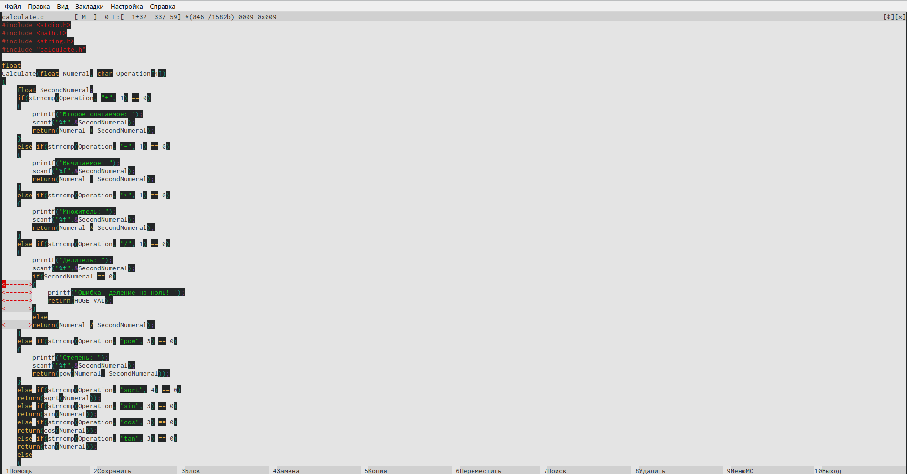
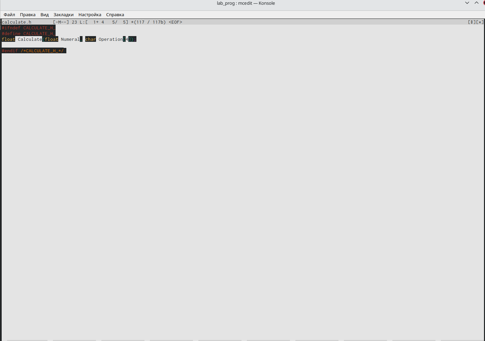
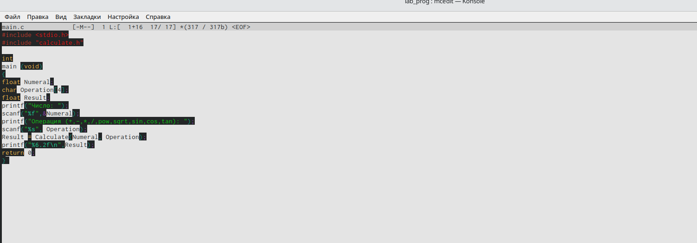

---
## Front matter
lang: ru-RU
title: Лабораторная работа №13
author: Хусяинова Адиля Фаритовна
institute: \inst{1}RUDN University, Moscow, Russian Federation

## Formatting
toc: false
slide_level: 2
theme: metropolis
header-includes: 
aspectratio: 43
section-titles: true
---

# Программа в calculate.c

 - Реалиция функций в файле calculate.c 
 
{ #fig:006 width=70% }

# Программа в calculate.h

 - Описывает формат вызова функции в калькуляторе 

{ #fig:006 width=70% }

# Программа main.c

 - Реализует интерфейс пользователя в калькуляторе
 
{ #fig:006 width=70% }

# Выводы 

 - В ходе данной лабораторной работы я приобрела навыки разработки, анализа, тестирования приложение в ОС Linux. Пример создания на языке программирования С калькулятора с простейшими функциями
