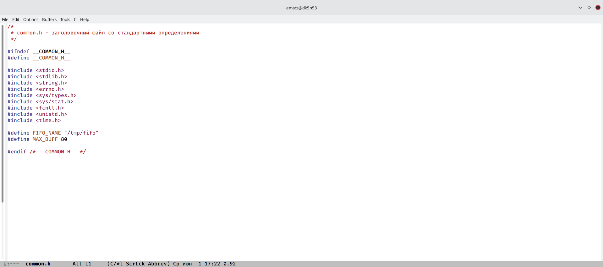
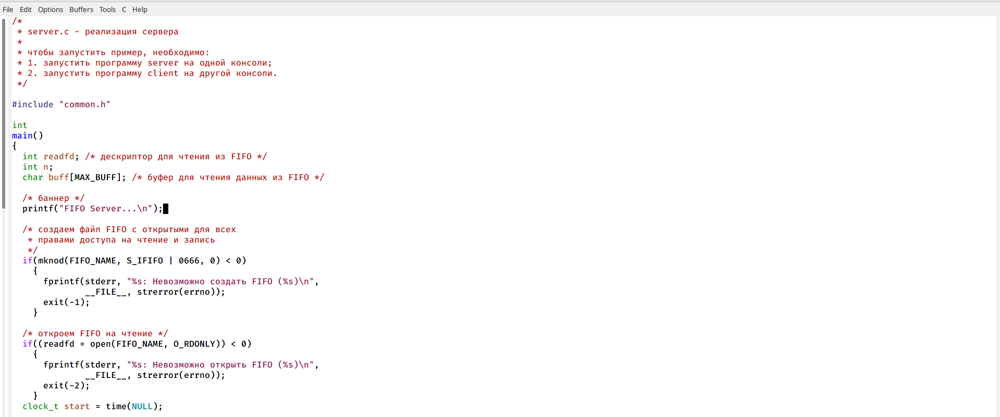
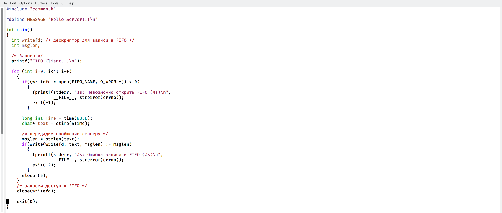
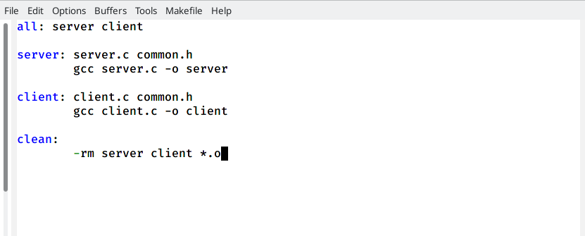

---
## Front matter
lang: ru-RU
title: Лабораторная работа №14
author: Хусяинова Адиля Фаритовна
institute: \inst{1}RUDN University, Moscow, Russian Federation

## Formatting
toc: false
slide_level: 2
theme: metropolis
header-includes: 
aspectratio: 43
section-titles: true
---

# Создание файла common.h

 - Данный файл предназначен для заголовочных файлов. В других программах можно не прописывать
 
{ #fig:002 width=70% }

# Создание server.c 

- В данный файл добавляем цикл while, чтобы иметь возможность контролировать время работы файла

{ #fig:003 width=70% }

# Создание common.h

 - В файл добавляем цикл, который ответственнен за количество сообщений о текущем времени

{ #fig:005 width=70% }

# Работа с Makefile

 - Не изменяла данный файл, он предназначен для сборки
 
{ #fig:006 width=70% } 

# Выводы

 - В ходе данной лабораторной работы я приобрела навыки работы с именнованными файлами
